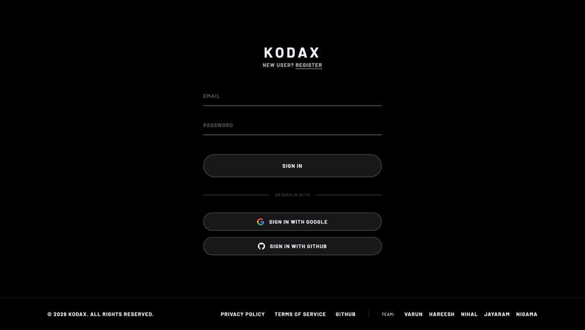
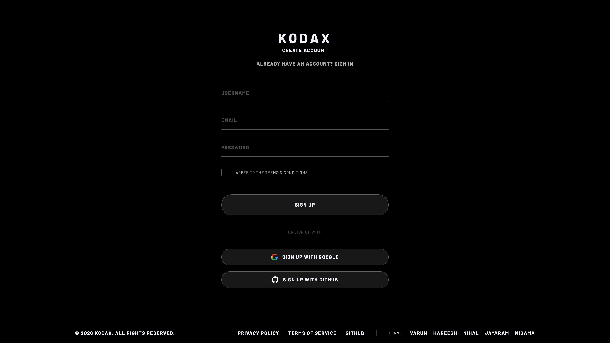
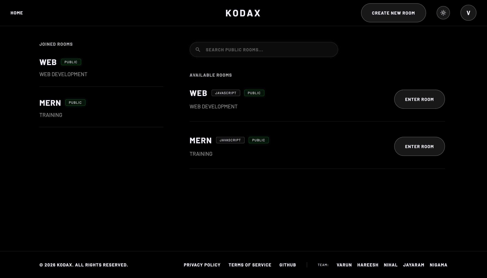
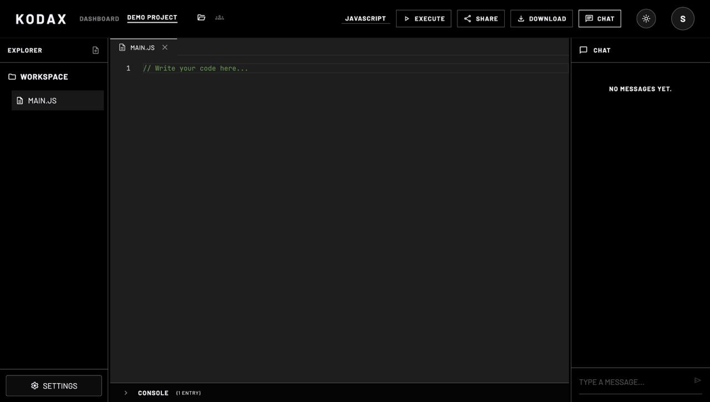
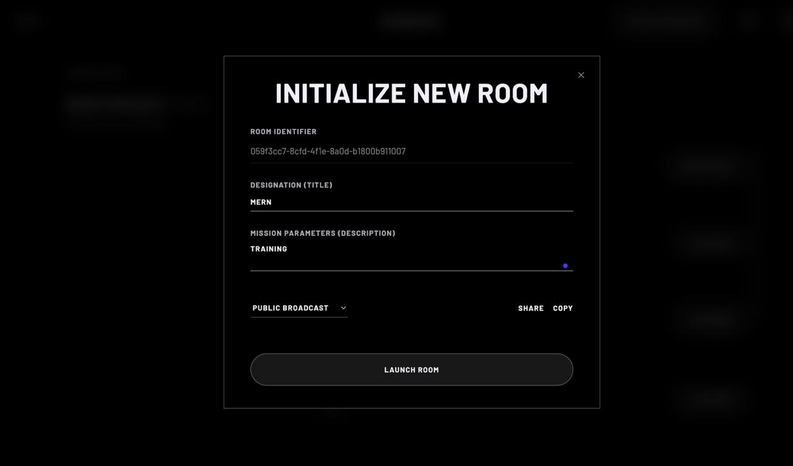

<div align="center">

# ⚡ KodaX

### *Where developers take control*

A premium, highly-scalable **real-time collaborative code editor** that lets multiple developers write, edit, debug, and execute code together — seamlessly and in real time.

[](https://nodejs.org/)
[](https://expressjs.com/)
[](https://socket.io/)
[](https://www.mongodb.com/)
[](https://react.dev/)
[](https://tailwindcss.com/)
[](https://vite.dev/)
[](LICENSE)

</div>

---

## 📸 Screenshots

### 🔐 Login


### 📝 Register


### 🏠 Dashboard


### 🖥️ Room Editor


### Create Room


---

## 📖 Table of Contents

- [💡 About KodaX](#-about-kodax)
- [✨ Core Features](#-core-features)
- [🏗 System Architecture](#-system-architecture)
- [📁 Project Structure](#-project-structure)
- [📡 API & Socket Reference](#-api--socket-reference)
- [🛡 Roles & Permissions](#-roles--permissions)
- [🚀 Quick Start Guide](#-quick-start-guide)
- [⚙️ Environment Variables](#️-environment-variables)
- [🗺 Roadmap](#-roadmap)
- [🤝 Contributing](#-contributing)
- [📄 License](#-license)

---

## 💡 About KodaX

KodaX was built to solve the friction of remote pair programming. By combining a lightning-fast React 19 frontend with a highly secure, room-based Node.js/Express backend and real-time Socket.IO infrastructure, KodaX provides a **Google Docs-like experience** designed specifically for multi-language **code execution and developer collaboration**.

Whether you're conducting technical interviews, mentoring junior developers, or debugging a tricky server issue with your team — KodaX gives you the isolated, real-time environment you need.

---

## ✨ Core Features

### 🔐 Authentication
- **Multi-Provider Auth**: Local (email/password), Google OAuth, and GitHub OAuth
- **JWT Cookie Auth**: HTTP-only secure JWT cookies — no localStorage exposure
- **Password Hashing**: `bcrypt` with salt rounds for local credentials
- **Smart Social Login**: Automatically links social accounts to existing email accounts

### 🏠 Room Management
- Create public or private coding rooms with unique UUID room IDs
- **Search**: Full-text search across all public rooms (title + description indexed)
- **Join Requests**: Private rooms use a pending-approval flow
- **Settings**: Owners can update title, description, max users, visibility, and guest access

### 👥 Role-Based Access Control (RBAC)
Three-tier hierarchy — `Owner` → `Moderator` → `Member`:
- Owners have full administrative control
- Moderators can manage members and approve/reject join requests
- Members can read/write code and chat but cannot administer

### ⚡ Real-Time Collaboration (Socket.IO)
- **Instant Code Sync**: Every keystroke broadcast in real time; persisted to MongoDB
- **Multi-File System**: Create, rename, delete files per room; all synced live
- **Live Cursor Tracking**: See collaborators' cursors with color-coded name labels inside the Monaco editor
- **Typing Indicators**: See who's currently typing in chat
- **Live Chat**: Persistent room chat history stored in MongoDB
- **Code Execution**: Run code via JDoodle API — output broadcast to all members simultaneously
- **Join Request Flow**: Socket-based real-time approval/rejection of access requests

### 🛠️ VS Code-Like Editor
- **Monaco Editor**: The same engine powering VS Code, embedded in the browser
- **8 Languages**: JavaScript, Python, Java, C++, C, Ruby, Go, PHP
- **File Explorer**: Sidebar panel with workspace file tree and add/delete actions
- **Editor Tabs**: Multi-tab editor with close buttons
- **Console Panel**: Resizable output console for code execution results
- **Chat Panel**: Resizable slide-in chat panel
- **Members Panel**: See all room members, their roles, and manage them

### 📐 Resizable Panels
All three side/bottom panels (File Explorer, Chat, Console) are **drag-to-resize** with sensible min/max constraints.

### 📦 Workspace Export
Download the entire room's multi-file workspace as a `.zip` archive with one click.

### 🔗 Room Sharing
Copy the current room URL to clipboard for instant sharing.

---

## 🏗 System Architecture

```
┌────────────────────┐         WebSocket (Socket.IO v4)          ┌──────────────────────┐
│                    │◄────────────────────────────────────────►│                      │
│   React 19         │                                           │   Node.js            │
│   Frontend         │─────────── REST API (Express v5) ───────►│   Backend            │
│   (Vite + TW v4)   │◄────────── HTTP + JWT Cookies ───────────│   Engine             │
│                    │                                           │                      │
└────────────────────┘                                           └──────────┬───────────┘
                                                                            │
                                                                   Mongoose v9
                                                                            │
                                                                            ▼
                                                                 ┌──────────────────────┐
                                                                 │       MongoDB        │
                                                                 │  • Users             │
                                                                 │  • Rooms (+ Files)   │
                                                                 │  • Messages          │
                                                                 └──────────────────────┘
                                                                            │
                                                                 ┌──────────────────────┐
                                                                 │   JDoodle API        │
                                                                 │  (Code Execution)    │
                                                                 │   8 Languages        │
                                                                 └──────────────────────┘
```

### Data Flow

```
User Keystroke → Socket Emit → Backend Handler → MongoDB Save → Broadcast to Room Members
User Runs Code → Socket Emit → JDoodle API  → Result Emit → All Members See Output
```

---

## 📁 Project Structure

```
KodaX/
├── backend/                           # Node.js + Express + Socket.IO Backend
│   ├── config/
│   │   └── db.js                      # MongoDB connection (Mongoose)
│   ├── controllers/                   # Business logic layer
│   │   ├── authController.js          # Register, Login, Logout, Google OAuth, GitHub OAuth, GetMe
│   │   ├── chatController.js          # Fetch chat message history for a room
│   │   ├── codeController.js          # Fetch and save code state for a room
│   │   └── roomController.js          # Full CRUD: rooms, join requests, RBAC, admin actions
│   ├── middleware/
│   │   └── authMiddleware.js          # JWT verification middleware (cookie + header support)
│   ├── models/                        # Mongoose schemas
│   │   ├── Message.js                 # { roomId, sender, message, timestamps }
│   │   ├── Room.js                    # { roomId, title, desc, files[], members[], RBAC, settings }
│   │   └── User.js                    # { username, email, password, providers[], socketId }
│   ├── routes/                        # Express route definitions
│   │   ├── authRoutes.js              # /api/auth → register, login, logout, google, github, me
│   │   ├── chatRoutes.js              # /api/chat → get messages
│   │   ├── codeRoutes.js              # /api/code → get & save code
│   │   └── roomRoutes.js              # /api/room → full room management API
│   ├── sockets/                       # Socket.IO real-time layer
│   │   ├── index.js                   # Registers all socket handlers on connection
│   │   ├── handlers/
│   │   │   ├── presence/
│   │   │   │   ├── UserOnline.js      # Sets socketId on connect, marks user online
│   │   │   │   └── disconnect.js      # Clears session on disconnect
│   │   │   ├── requests/
│   │   │   │   ├── requestJoin.js     # Emits join request to owner/mods
│   │   │   │   ├── approveRequest.js  # Approves pending join request
│   │   │   │   └── rejectRequest.js   # Rejects pending join request
│   │   │   └── room/
│   │   │       ├── joinRoom.js        # Adds socket to room, broadcasts user_joined
│   │   │       ├── leaveRoom.js       # Removes socket from room
│   │   │       ├── codeChange.js      # Syncs code edits → DB → room broadcast
│   │   │       ├── cursorMove.js      # Broadcasts cursor position
│   │   │       ├── typing.js          # Broadcasts typing status
│   │   │       ├── roomChat.js        # Persists and broadcasts chat messages
│   │   │       └── runCode.js         # Executes code via JDoodle, broadcasts result
│   │   ├── middlewares/
│   │   │   └── socketAuth.js          # JWT auth for socket connections
│   │   └── utils/
│   │       ├── emitToRoom.js          # Broadcast to all users in a room
│   │       └── emitToUser.js          # Emit to a specific user
│   ├── app.js                         # Express app: CORS, cookie-parser, route mounting
│   ├── server.js                      # Entry point: HTTP server + Socket.IO init
│   └── package.json
│
├── frontend/                          # React 19 + Vite 8 + Tailwind CSS v4
│   ├── src/
│   │   ├── app/
│   │   │   ├── App.jsx                # Root component (RouterProvider)
│   │   │   ├── main.jsx               # Vite entry point (providers)
│   │   │   └── routes.jsx             # React Router v7 route definitions
│   │   ├── components/
│   │   │   ├── KodaxLogo.jsx          # Animated SVG logo component
│   │   │   ├── ProtectedRoute.jsx     # Redirects unauthenticated users to /login
│   │   │   ├── PublicRoute.jsx        # Redirects authenticated users to /
│   │   │   ├── chat/                  # Chat UI components
│   │   │   ├── common/                # Reusable: Button, Input, Modal, Loader
│   │   │   ├── create-room/           # CreateRoomModal component
│   │   │   ├── dashboard/             # RoomDetailsModal component
│   │   │   ├── editor/                # Editor stubs (MonacoWrapper, Toolbar, etc.)
│   │   │   ├── footer/                # Footer component
│   │   │   ├── home/                  # Home page sub-components
│   │   │   ├── navbar/                # Navbar component
│   │   │   └── room/                  # ExplorerPanel, MembersPanel, EditorTabs,
│   │   │                              # ConsolePanel, ChatPanel, ResizeHandle,
│   │   │                              # RoomSettingsModal
│   │   ├── context/
│   │   │   ├── AuthContext.jsx        # Auth state (user, login, logout)
│   │   │   └── SocketProvider.jsx     # Socket.IO connection context
│   │   ├── hooks/
│   │   │   ├── useAuth.js             # Auth context consumer hook
│   │   │   ├── useDebounce.js         # Debounce utility
│   │   │   ├── useRoom.js             # Room operations hook
│   │   │   ├── useSocket.js           # Socket connection hook
│   │   │   └── useTypingIndicator.js  # Typing status hook
│   │   ├── pages/
│   │   │   ├── auth/
│   │   │   │   ├── Login.jsx          # Email/pass + Google/GitHub login
│   │   │   │   ├── Register.jsx       # Email/pass + Google/GitHub register
│   │   │   │   └── GithubCallback.jsx # GitHub OAuth redirect handler
│   │   │   ├── dashboard/
│   │   │   │   └── Dashboard.jsx      # Joined rooms + search + create room
│   │   │   ├── legal/
│   │   │   │   └── PolicyPage.jsx     # Privacy policy page
│   │   │   └── room/
│   │   │       └── RoomPage.jsx       # Full collaborative editor (954 lines)
│   │   ├── services/
│   │   │   ├── api/                   # Axios instance + API service functions
│   │   │   └── socket/                # Socket client + event handlers
│   │   ├── store/                     # Zustand-ready state stores (stubs)
│   │   │   ├── authStore.js
│   │   │   ├── chatStore.js
│   │   │   ├── editorStore.js
│   │   │   ├── roomStore.js
│   │   │   └── socketStore.js
│   │   └── utils/
│   │       ├── constants.js           # App-wide constants (API URL, enums)
│   │       ├── copyToClipboard.js     # Clipboard utility with fallback
│   │       ├── formatDate.js          # Date/time formatting helpers
│   │       ├── generateAvatar.js      # Initials/color avatar generation
│   │       └── roleHelpers.js         # RBAC permission check helpers
│   ├── index.html                     # Vite entry HTML (Material Icons CDN)
│   ├── vite.config.js                 # Vite config (React plugin)
│   ├── vercel.json                    # Vercel SPA routing config
│   └── package.json
│
├── docs/
│   └── screenshots/                   # App screenshots for README
│       ├── login.png
│       ├── register.png
│       ├── dashboard.png
│       └── room-editor.png
├── flows.md                           # Internal: system flow diagrams
├── usecase.md                         # Internal: API use cases & payloads
├── Readme.md                          # This file
├── LICENSE                            # MIT License
└── .gitignore
```

---

## 📡 API & Socket Reference

> Full backend API documentation → [`backend/README.md`](./backend/README.md)
> Frontend documentation → [`frontend/README.md`](./frontend/README.md)

### REST API Endpoints

#### Authentication — `/api/auth`

| Method | Endpoint | Auth | Description |
|--------|----------|:----:|-------------|
| `POST` | `/api/auth/register` | ❌ | Register with username, email, password |
| `POST` | `/api/auth/login` | ❌ | Login with email + password → JWT cookie |
| `POST` | `/api/auth/google` | ❌ | Google OAuth (credential or access_token) |
| `POST` | `/api/auth/github` | ❌ | GitHub OAuth (authorization code exchange) |
| `POST` | `/api/auth/logout` | ❌ | Clear JWT cookie |
| `GET`  | `/api/auth/me` | ✅ | Get current user profile |

#### Room Management — `/api/room`

| Method | Endpoint | Auth | Role | Description |
|--------|----------|:----:|------|-------------|
| `POST` | `/api/room/create` | ✅ | Any | Create a new room |
| `GET`  | `/api/room/my-rooms` | ✅ | Any | List rooms I'm a member of |
| `GET`  | `/api/room/search?q=` | ✅ | Any | Full-text search public rooms |
| `GET`  | `/api/room/:roomId` | ✅ | Member | Get room details |
| `POST` | `/api/room/:roomId/request-join` | ✅ | Any | Request to join (auto-join if public) |
| `GET`  | `/api/room/:roomId/pending` | ✅ | Owner/Mod | View pending requests |
| `POST` | `/api/room/:roomId/approve/:userId` | ✅ | Owner/Mod | Approve a join request |
| `POST` | `/api/room/:roomId/reject/:userId` | ✅ | Owner/Mod | Reject a join request |
| `POST` | `/api/room/:roomId/leave` | ✅ | Member | Leave a room |
| `POST` | `/api/room/:roomId/remove/:userId` | ✅ | Owner/Mod | Kick a member |
| `PATCH` | `/api/room/:roomId/promote/:userId` | ✅ | Owner | Promote to moderator |
| `PATCH` | `/api/room/:roomId/demote/:userId` | ✅ | Owner | Demote to member |
| `PATCH` | `/api/room/:roomId/transfer-ownership/:userId` | ✅ | Owner | Transfer ownership |
| `PATCH` | `/api/room/:roomId/settings` | ✅ | Owner/Mod | Update room settings |
| `DELETE` | `/api/room/:roomId` | ✅ | Owner | Delete room |

#### Chat — `/api/chat`

| Method | Endpoint | Auth | Description |
|--------|----------|:----:|-------------|
| `GET` | `/api/chat/:roomId` | ✅ | Fetch message history |

#### Code — `/api/code`

| Method | Endpoint | Auth | Description |
|--------|----------|:----:|-------------|
| `GET` | `/api/code/:roomId` | ✅ | Fetch current code and language |
| `PUT` | `/api/code/:roomId` | ✅ | Save/update code and language |

---

### WebSocket Events

#### Presence

| Event | Direction | Payload | Description |
|-------|-----------|---------|-------------|
| `connection` | Client → Server | JWT via cookie | Authenticates socket, registers session |
| `disconnect` | Client → Server | — | Clears socketId, broadcasts `user_offline` |

#### Room

| Event | Direction | Payload | Description |
|-------|-----------|---------|-------------|
| `join_room` | C → S | `{ roomId }` | Subscribe socket to room → broadcasts `user_joined` |
| `leave_room` | C → S | `{ roomId }` | Unsubscribe → broadcasts `user_left` |
| `code_change` | C → S | `{ roomId, fileId, code }` | Syncs keystroke → DB → broadcasts `code_updated` |
| `language_change` | C → S | `{ roomId, fileId, language }` | Syncs language → broadcasts `language_updated` |
| `cursor_move` | C → S | `{ roomId, position }` | Broadcasts `cursor_updated` to room |
| `typing` | C → S | `{ roomId }` | Broadcasts `user_typing` |
| `send_message` | C → S | `{ roomId, message }` | Persists to DB → broadcasts `receive_message` |
| `run_code` | C → S | `{ roomId, code, language }` | Executes via JDoodle → `code_running` then `code_result` |
| `add_file` | C → S | `{ roomId, file }` | Adds file → DB → broadcasts `file_added` |
| `delete_file` | C → S | `{ roomId, fileId }` | Removes file → DB → broadcasts `file_deleted` |

#### Join Requests

| Event | Direction | Payload | Description |
|-------|-----------|---------|-------------|
| `request_join` | C → S | `{ roomId }` | Notifies owner/mods of join request |
| `approve_request` | C → S | `{ roomId, userId }` | Approves pending request |
| `reject_request` | C → S | `{ roomId, userId }` | Rejects pending request |

---

## 🛡 Roles & Permissions

KodaX uses a strict, database-enforced RBAC matrix:

| Action | Owner | Moderator | Member |
|--------|:-----:|:---------:|:------:|
| View room & code | ✅ | ✅ | ✅ |
| Edit code | ✅ | ✅ | ❌ (view-only) |
| Chat | ✅ | ✅ | ✅ |
| Run code | ✅ | ✅ | ❌ |
| Add / delete files | ✅ | ✅ | ❌ |
| Download workspace | ✅ | ✅ | ✅ |
| Leave room | ✅ | ✅ | ✅ |
| View pending requests | ✅ | ✅ | ❌ |
| Approve / reject joins | ✅ | ✅ | ❌ |
| Kick members | ✅ | ✅ | ❌ |
| Update room settings | ✅ | ✅ | ❌ |
| Promote / demote users | ✅ | ❌ | ❌ |
| Transfer ownership | ✅ | ❌ | ❌ |
| Delete room | ✅ | ❌ | ❌ |

> **View-only mode**: Members see a `VIEW ONLY` badge in the editor toolbar. They can read and download code but cannot type or run it.

---

## 🚀 Quick Start Guide

### Prerequisites

- [Node.js](https://nodejs.org/) v18+
- [MongoDB](https://www.mongodb.com/) (local or Atlas)
- [Git](https://git-scm.com/)
- JDoodle API keys (free tier available at [jdoodle.com](https://www.jdoodle.com/compiler-api))
- Google OAuth credentials ([console.cloud.google.com](https://console.cloud.google.com))
- GitHub OAuth App ([github.com/settings/developers](https://github.com/settings/developers))

### 1. Clone the Repository

```bash
git clone https://github.com/Varun2526/Real_time_collaborative_code-editor.git
cd Real_time_collaborative_code-editor
```

### 2. Backend Setup

```bash
cd backend
npm install
```

Copy and fill in the environment file:

```bash
cp .env.example .env
```

```env
# Database
DB_URL=mongodb://localhost:27017/REAL-TIME-CODE-EDITOR
PORT=4000

# JWT
JWT_SECRET=your_super_secret_jwt_key_at_least_32_chars

# Google OAuth
GOOGLE_CLIENT_ID=your_google_client_id
GOOGLE_CLIENT_SECRET=your_google_client_secret

# GitHub OAuth
GITHUB_CLIENT_ID=your_github_client_id
GITHUB_CLIENT_SECRET=your_github_client_secret

# JDoodle Code Execution
JDOODLE_CLIENT_ID=your_jdoodle_client_id
JDOODLE_CLIENT_SECRET=your_jdoodle_client_secret

# Production only
NODE_ENV=development
CLIENT_URL=http://localhost:5173
```

Start the backend:

```bash
npm run dev
# ✅ Backend running at http://localhost:4000
```

### 3. Frontend Setup

```bash
cd ../frontend
npm install
```

Copy and fill in the environment file:

```bash
cp .env.example .env
```

```env
# Must match your backend GOOGLE_CLIENT_ID
VITE_GOOGLE_CLIENT_ID=your_google_client_id

# Must match your backend GITHUB_CLIENT_ID
VITE_GITHUB_CLIENT_ID=your_github_client_id

# Optional: override API URL
VITE_API_URL=http://localhost:4000/api
VITE_SOCKET_URL=http://localhost:4000
```

Start the dev server:

```bash
npm run dev
# ✅ Frontend running at http://localhost:5173
```

### 4. OAuth Setup Notes

**Google OAuth:**
- Add `http://localhost:5173` to Authorized JavaScript origins
- Credential type: Web application

**GitHub OAuth:**
- Homepage URL: `http://localhost:5173`
- Callback URL: `http://localhost:5173/auth/github/callback`

---

## ⚙️ Environment Variables

### Backend (`backend/.env`)

| Variable | Required | Description |
|----------|:--------:|-------------|
| `DB_URL` | ✅ | MongoDB connection string |
| `PORT` | ❌ | Server port (default: 4000) |
| `JWT_SECRET` | ✅ | Secret for signing JWT tokens |
| `GOOGLE_CLIENT_ID` | ⚠️ | Required for Google OAuth |
| `GOOGLE_CLIENT_SECRET` | ⚠️ | Required for Google OAuth |
| `GITHUB_CLIENT_ID` | ⚠️ | Required for GitHub OAuth |
| `GITHUB_CLIENT_SECRET` | ⚠️ | Required for GitHub OAuth |
| `JDOODLE_CLIENT_ID` | ⚠️ | Required for code execution |
| `JDOODLE_CLIENT_SECRET` | ⚠️ | Required for code execution |
| `NODE_ENV` | ❌ | `development` or `production` |
| `CLIENT_URL` | ❌ | Frontend URL for CORS (production) |

### Frontend (`frontend/.env`)

| Variable | Required | Description |
|----------|:--------:|-------------|
| `VITE_GOOGLE_CLIENT_ID` | ⚠️ | Required for Google OAuth button |
| `VITE_GITHUB_CLIENT_ID` | ⚠️ | Required for GitHub OAuth button |
| `VITE_API_URL` | ❌ | Backend API base URL (default: `http://localhost:4000/api`) |
| `VITE_SOCKET_URL` | ❌ | Backend socket URL (default: `http://localhost:4000`) |

---

## 🗺 Roadmap

### Completed ✅
- [x] Multi-provider authentication (Local, Google OAuth, GitHub OAuth)
- [x] Room-based architecture with unique UUID room IDs
- [x] Role-Based Access Control (Owner → Moderator → Member)
- [x] Real-time code synchronization via Socket.IO
- [x] Multi-file system (create, delete, language-per-file)
- [x] Persistent in-room chat with history
- [x] Server-side code execution (JDoodle, 8 languages)
- [x] Live cursor tracking with user labels in Monaco Editor
- [x] Typing indicators in chat
- [x] Socket-based join request approval/rejection flow
- [x] Advanced room administration (promote, demote, transfer, kick, delete)
- [x] Resizable panels (Explorer, Chat, Console)
- [x] Workspace ZIP download
- [x] Room URL sharing/copy
- [x] Privacy policy + legal pages
- [x] Full-text search on public rooms
- [x] View-only mode for Member role

### In Progress 🔄
- [ ] Zustand store integration (stores stubbed, not yet wired to components)
- [ ] Reusable UI component library (common/ stubs need completion)
- [ ] Socket service layer refactor (services/socket/)

### Planned 📋
- [ ] Global deployment (Vercel frontend + Render backend)
- [ ] Yjs / CRDT-based conflict-free operational transform for true offline-first sync
- [ ] Persistent file versioning / code history
- [ ] AI code suggestions (Copilot-like)
- [ ] Room templates (boilerplate starter files)
- [ ] Notification system (in-app alerts)

---

## 🤝 Contributing

Contributions are welcome! Please read the guidelines before submitting.

1. **Fork** the repository
2. **Create** a feature branch: `git checkout -b feature/your-feature-name`
3. **Commit** your changes: `git commit -m 'feat: add your feature'`
4. **Push** to the branch: `git push origin feature/your-feature-name`
5. **Open a Pull Request** against `main`

### Commit Convention

Use [Conventional Commits](https://www.conventionalcommits.org/):
- `feat:` — new feature
- `fix:` — bug fix
- `docs:` — documentation only
- `refactor:` — code change without feature/fix
- `chore:` — build, tooling, or config

---

## 👥 Team

| Name | Role |
|------|------|
| Varun |  Developer |
| Hareesh | Developer |
| Nihal | Developer |
| Jayaram | Developer |
| Nigama | Developer |

---

## 📄 License

This project is open source and available under the [MIT License](LICENSE).

---

<div align="center">
<i>Engineered with precision for the modern developer workflow.</i><br/>
<b>KodaX © 2026</b>
</div>
