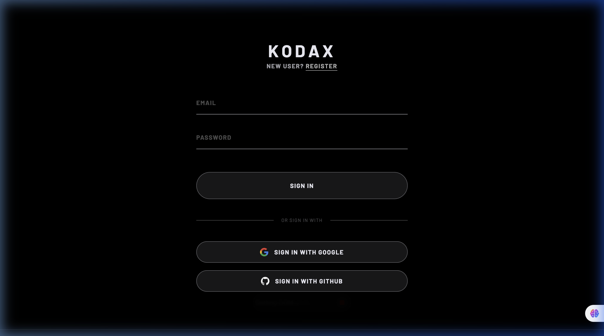
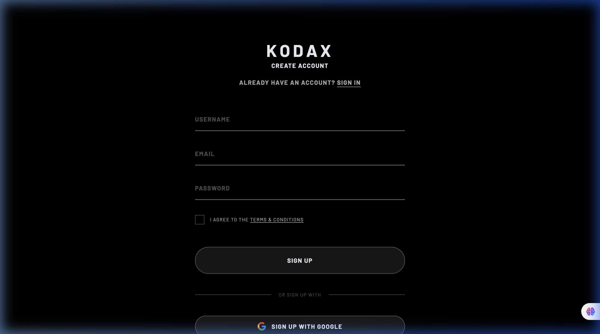
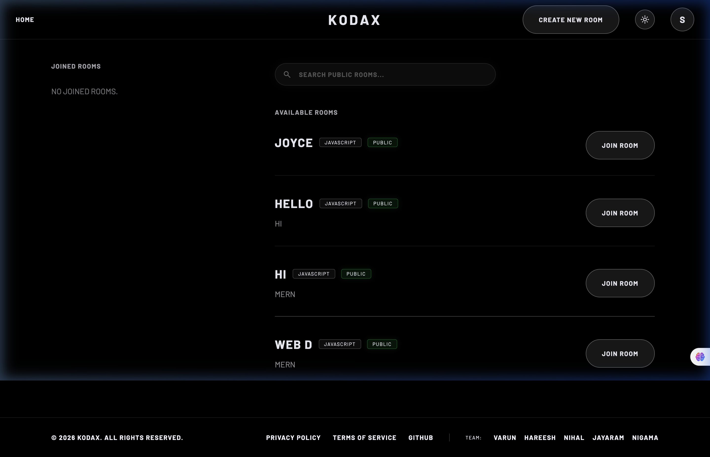
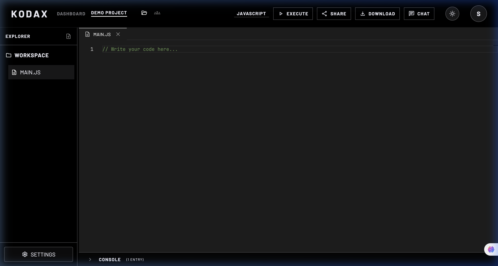

# 🎨 KodaX — Frontend

> React 19 + Vite 8 + Tailwind CSS v4 frontend for the KodaX real-time collaborative code editor.

[](https://react.dev/)
[](https://vite.dev/)
[](https://tailwindcss.com/)
[](https://reactrouter.com/)
[](https://github.com/suren-atoyan/monaco-react)

---

## 📸 Screenshots

### Login Page


### Register Page


### Dashboard


### Room Editor


---

## 📖 Table of Contents

- [Overview](#overview)
- [Directory Structure](#directory-structure)
- [Pages & Routing](#pages--routing)
- [Components](#components)
- [State Management](#state-management)
- [Hooks](#hooks)
- [Services](#services)
- [Utilities](#utilities)
- [Environment Variables](#environment-variables)
- [Design System](#design-system)
- [Running Locally](#running-locally)
- [Scripts](#scripts)
- [Dependencies](#dependencies)

---

## Overview

The KodaX frontend is a single-page application built with **React 19** and **Vite 8**. It provides a SpaceX-inspired dark-mode UI featuring:

- **Authentication flows** — Email/password, Google OAuth, GitHub OAuth
- **Dashboard** — Browse and search public rooms, manage joined rooms
- **VS Code-like Editor** — Monaco editor with multi-file tabs, file explorer, resizable panels
- **Real-time Collaboration** — Live cursor tracking, instant code sync, in-room chat, code execution

---

## Directory Structure

```
frontend/src/
├── app/
│   ├── App.jsx                     # Root component — wraps RouterProvider
│   ├── main.jsx                    # Vite entry — AuthProvider + RouterProvider
│   └── routes.jsx                  # React Router v7 route tree
│
├── components/
│   ├── KodaxLogo.jsx               # Animated SVG/text logo component
│   ├── ProtectedRoute.jsx          # Redirects to /login if unauthenticated
│   ├── PublicRoute.jsx             # Redirects to / if authenticated
│   ├── chat/                       # (stubs) Chat sub-components
│   ├── common/                     # (stubs) Button, Input, Modal, Loader
│   ├── create-room/
│   │   └── CreateRoomModal.jsx     # Modal to create a new room
│   ├── dashboard/
│   │   └── RoomDetailsModal.jsx    # Modal with room details + join/enter CTA
│   ├── editor/                     # (stubs) MonacoWrapper, Toolbar, LanguageSelector
│   ├── footer/
│   │   └── Footer.jsx              # Site footer with team credits
│   ├── home/                       # (stubs) Home page sub-components
│   ├── navbar/
│   │   └── Navbar.jsx              # Global navigation bar
│   └── room/
│       ├── ExplorerPanel.jsx       # File tree sidebar
│       ├── MembersPanel.jsx        # Members list + admin actions
│       ├── EditorTabs.jsx          # Multi-file tab bar
│       ├── ConsolePanel.jsx        # Resizable output console
│       ├── ChatPanel.jsx           # Slide-in real-time chat
│       ├── ResizeHandle.jsx        # Draggable resize handle
│       └── RoomSettingsModal.jsx   # Room settings (owner/mod only)
│
├── context/
│   ├── AuthContext.jsx             # Auth state (user, setUser) — React Context
│   └── SocketProvider.jsx          # (stub) Socket.IO connection context
│
├── hooks/
│   ├── useAuth.js                  # useContext(AuthContext) consumer
│   ├── useDebounce.js              # Debounce a value by N milliseconds
│   ├── useRoom.js                  # Room operations hook (stub)
│   ├── useSocket.js                # Socket connection hook (stub)
│   └── useTypingIndicator.js      # Typing status hook (stub)
│
├── pages/
│   ├── auth/
│   │   ├── Login.jsx               # Login: email/pass + Google + GitHub
│   │   ├── Register.jsx            # Register: email/pass + Google + GitHub
│   │   └── GithubCallback.jsx      # GitHub OAuth callback handler
│   ├── dashboard/
│   │   └── Dashboard.jsx           # Main dashboard (joined + available rooms)
│   ├── legal/
│   │   └── PolicyPage.jsx          # Privacy policy page
│   └── room/
│       └── RoomPage.jsx            # Full collaborative editor (main page)
│
├── services/
│   ├── api/                        # Axios instance + API functions (stub)
│   └── socket/                     # Socket client + handlers (stub)
│
├── store/
│   ├── authStore.js                # Auth Zustand store (stub)
│   ├── chatStore.js                # Chat Zustand store (stub)
│   ├── editorStore.js              # Editor Zustand store (stub)
│   ├── roomStore.js                # Room Zustand store (stub)
│   └── socketStore.js              # Socket Zustand store (stub)
│
├── utils/
│   ├── constants.js                # App constants (API URL, supported languages, etc.)
│   ├── copyToClipboard.js          # Clipboard API with textarea fallback
│   ├── formatDate.js               # Date/time formatting (relative + absolute)
│   ├── generateAvatar.js           # Initials + color avatar generator
│   └── roleHelpers.js              # RBAC: canEdit, canManage, isOwner, etc.
│
├── index.css                       # Global Tailwind theme + custom utilities
└── App.css                         # App-level overrides
```

---

## Pages & Routing

Routing is handled by **React Router v7** (`createBrowserRouter`).

```
/                     → Dashboard (protected)
/login                → Login page (public only)
/register             → Register page (public only)
/auth/github/callback → GitHub OAuth callback (public only)
/room/:roomId         → Room editor (protected)
/privacy-policy       → Privacy policy (public)
*                     → Redirect to /privacy-policy
```

### Route Guards

- **`ProtectedRoute`** — Checks `AuthContext.user`. If null, redirects to `/login`.
- **`PublicRoute`** — Checks `AuthContext.user`. If set, redirects to `/`.

---

## Components

### `RoomPage.jsx`
The most complex component (~950 lines). Manages:
- Socket.IO connection lifecycle (connect/disconnect on mount/unmount)
- Multi-file state (`files[]`, `activeFileId`, `openTabs[]`)
- Monaco Editor with remote cursor content widgets
- Real-time event listeners (`code_updated`, `cursor_updated`, `receive_message`, `code_result`, etc.)
- All panel states (explorer width, chat width, console height, visibility toggles)
- All admin actions (approve/reject requests, kick, promote, demote, transfer, leave, delete)
- Room settings modal

**Key state:**
```js
const [files, setFiles] = useState([]);           // All files in workspace
const [activeFileId, setActiveFileId] = useState(null);
const [openTabs, setOpenTabs] = useState([]);     // Tab order
const [messages, setMessages] = useState([]);     // Chat messages
const [consoleOutput, setConsoleOutput] = useState([]);
const [activeMembers, setActiveMembers] = useState([]);
const [remoteCursors, setRemoteCursors] = useState({});
```

**Remote Cursor Rendering:**
Uses Monaco's `ContentWidget` API to overlay colored cursor flags with usernames directly inside the editor.

### `Dashboard.jsx`
- Fetches user's joined rooms on mount
- Debounced search (300ms) for public rooms
- Opens `RoomDetailsModal` on room click
- `CreateRoomModal` via navbar CTA

### `Navbar.jsx`
Responsive navigation bar. In dashboard mode shows user avatar + "Create New Room" button. In room mode shows breadcrumb navigation, panel toggles, language selector, and action buttons (Execute, Share, Download, Chat).

### `ExplorerPanel.jsx`
File tree sidebar with:
- Workspace title header
- File list with click-to-open, delete button
- Add file input (supports any extension, infers language from extension)

### `MembersPanel.jsx`
Shows all room members with:
- Role badges (OWNER / MOD / MEMBER)
- Admin actions based on current user's role:
  - Owner sees: promote, demote, transfer, kick
  - Mod sees: kick (members only)
- Pending requests section (Owner/Mod only) with approve/reject

### `ConsolePanel.jsx`
Bottom-anchored panel showing timestamped console entries:
- `info` — grey/dim
- `result` — green
- `error` — red

### `ChatPanel.jsx`
Right-anchored slide-in chat panel with:
- Message history loaded from REST API on mount
- Real-time new messages via `receive_message` socket event
- Message input with send on Enter or button click
- Unread badge counter (increments when chat is closed)

---

## State Management

### Current Implementation
State is currently managed with **React `useState`** within components, primarily `RoomPage.jsx`.

### AuthContext
```jsx
// AuthContext.jsx
const [user, setUser] = useState(null);
// user shape: { id, username, email, profilePic }
```
Auth state is initialized by calling `GET /api/auth/me` on app mount in `main.jsx`.

### Zustand Stores (Stubbed)
The `store/` directory contains stubs for future Zustand migration:
- `authStore.js` — auth state
- `chatStore.js` — chat messages
- `editorStore.js` — editor files/language
- `roomStore.js` — room metadata + members
- `socketStore.js` — socket connection state

---

## Hooks

### `useAuth`
```js
import { useAuth } from '../context/AuthContext';
const { user, setUser } = useAuth();
```

### `useDebounce`
```js
import useDebounce from '../hooks/useDebounce';
const debouncedQuery = useDebounce(searchQuery, 300);
```

### `useRoom` *(stub)*
Intended for room fetch/join/leave operations.

### `useSocket` *(stub)*
Intended for Socket.IO connection management.

### `useTypingIndicator` *(stub)*
Intended to manage typing indicator state.

---

## Services

### `services/api/` *(stub)*
Intended to contain a configured Axios instance and API service functions:
```
axiosInstance.js   ← Axios with baseURL, withCredentials, interceptors
authApi.js         ← login(), register(), logout(), getMe()
roomApi.js         ← createRoom(), getRoom(), joinRoom(), etc.
chatApi.js         ← getMessages()
```

**Currently:** API calls are made directly with `import axios from 'axios'` in page components.

### `services/socket/` *(stub)*
Intended to contain socket event definitions and handlers separate from UI components.

---

## Utilities

### `constants.js`
```js
export const API_URL = import.meta.env.VITE_API_URL || 'http://localhost:4000/api';
export const SOCKET_URL = import.meta.env.VITE_SOCKET_URL || 'http://localhost:4000';
export const SUPPORTED_LANGUAGES = ['javascript', 'python', 'java', 'c++', 'c', 'ruby', 'go', 'php'];
```

### `roleHelpers.js`
```js
export const isOwner = (role) => role === 'owner';
export const isModerator = (role) => role === 'moderator';
export const canEdit = (role) => role === 'owner' || role === 'moderator';
export const canManageMembers = (role) => role === 'owner' || role === 'moderator';
export const canDeleteRoom = (role) => role === 'owner';
// ... more helpers
```

### `generateAvatar.js`
Generates a consistent color + initials avatar for users without a profile picture.

### `formatDate.js`
Provides relative time formatting (`2 minutes ago`, `just now`) and absolute formatting.

### `copyToClipboard.js`
Uses `navigator.clipboard.writeText` with a `textarea` fallback for older browsers.

---

## Environment Variables

Create `frontend/.env` from `frontend/.env.example`:

| Variable | Required | Description |
|----------|:--------:|-------------|
| `VITE_GOOGLE_CLIENT_ID` | ⚠️ | Google OAuth client ID (for Google button) |
| `VITE_GITHUB_CLIENT_ID` | ⚠️ | GitHub OAuth client ID (for GitHub redirect) |
| `VITE_API_URL` | ❌ | Backend API base URL (default: `http://localhost:4000/api`) |
| `VITE_SOCKET_URL` | ❌ | Backend socket URL (default: `http://localhost:4000`) |

> All `VITE_` prefixed variables are exposed to the browser bundle. **Never put secrets here.**

---

## Design System

The UI uses a **SpaceX-inspired design language**:

- **Color palette**: Deep black (`#000`/`#0a0a0a`) background, pure white text, accent borders at `rgba(240,240,250,0.35)`
- **Typography**: Space Grotesk + custom tracking (`letter-spacing`) for headings; uppercase for labels
- **Tailwind custom classes** (defined in `index.css`):
  - `text-spacex-hero` — Large display heading
  - `text-spacex-h2` — Section heading
  - `text-spacex-nav` — Navigation text
  - `text-spacex-body` — Body text
  - `text-spacex-micro` — Badge/label text
  - `btn-ghost` — Outlined ghost button with hover fill
  - `font-body-base` — Default body font
  - `custom-scrollbar` — Styled thin scrollbar
- **Material Symbols Outlined** — Icon font loaded via Google CDN in `index.html`
- **Glassmorphism** — `backdrop-blur` + low-opacity borders for modal/panel overlays

---

## Running Locally

```bash
cd frontend
npm install
cp .env.example .env
# Fill in VITE_GOOGLE_CLIENT_ID and VITE_GITHUB_CLIENT_ID
npm run dev
# ✅  http://localhost:5173
```

**Backend must be running** on `http://localhost:4000` for API calls to work.

---

## Scripts

| Script | Command | Description |
|--------|---------|-------------|
| `npm run dev` | `vite` | Start dev server with HMR |
| `npm run build` | `vite build` | Production bundle to `dist/` |
| `npm run preview` | `vite preview` | Preview production build locally |
| `npm run lint` | `eslint .` | Run ESLint |

---

## Dependencies

### Runtime

| Package | Version | Purpose |
|---------|---------|---------|
| `react` | ^19.2.5 | UI library |
| `react-dom` | ^19.2.5 | DOM renderer |
| `react-router-dom` | ^7.15.0 | Client-side routing |
| `@monaco-editor/react` | ^4.7.0 | Monaco editor React wrapper |
| `socket.io-client` | ^4.8.3 | Real-time socket client |
| `axios` | ^1.16.0 | HTTP client |
| `@react-oauth/google` | ^0.13.5 | Google OAuth button |
| `tailwindcss` | ^4.2.4 | Utility-first CSS framework |
| `@tailwindcss/vite` | ^4.2.4 | Tailwind Vite plugin |
| `jszip` | ^3.10.1 | Zip file generation for workspace download |

### Dev

| Package | Purpose |
|---------|---------|
| `vite` | Build tool + dev server |
| `@vitejs/plugin-react` | React Fast Refresh |
| `eslint` | Linter |
| `eslint-plugin-react-hooks` | Hooks rules |
| `eslint-plugin-react-refresh` | HMR compatibility |

---

## Deployment

### Vercel (Frontend)

The `vercel.json` at the frontend root configures SPA routing:
```json
{
  "rewrites": [{ "source": "/(.*)", "destination": "/" }]
}
```

Set environment variables in the Vercel dashboard:
- `VITE_GOOGLE_CLIENT_ID`
- `VITE_GITHUB_CLIENT_ID`
- `VITE_API_URL` (your production backend URL)
- `VITE_SOCKET_URL` (your production backend URL)
