# KodaX — A Real-Time Collaborative Code Editor

### Summer Internship Report

---

> **Note for the candidate:** Items enclosed in square brackets such as `[Your Name]`, `[College Name]`, `[Mentor Name]`, and `[University Name]` are placeholders. Replace them with your actual details before final submission. The technical content has been written entirely from the source code present in this project workspace.

---

## Acknowledgement

I would like to express my sincere and heartfelt gratitude to everyone who supported and guided me throughout the course of my summer internship and the development of this project, **KodaX — A Real-Time Collaborative Code Editor**.

First and foremost, I extend my deepest appreciation to **[Internship Organization Name]** for granting me the opportunity to undertake my internship with their esteemed organization. The exposure to a professional software development environment, modern engineering practices, and real-world project workflows has been invaluable to my growth as an aspiring software engineer. The organization's culture of continuous learning and its emphasis on building scalable, production-quality software have profoundly shaped my technical outlook.

I am profoundly grateful to my industry mentor, **[Mentor Name]**, whose constant guidance, constructive feedback, and technical insight were instrumental at every stage of this project. Their willingness to clarify complex concepts—ranging from WebSocket-based real-time communication to secure authentication design—helped me transform an ambitious idea into a working, full-stack application. Their patience and encouragement motivated me to push beyond my comfort zone and adopt industry-standard development methodologies.

I would also like to sincerely thank my faculty guide, **[Faculty Guide Name]**, of the Department of **[Department Name]**, **[College Name]**, for their academic supervision, regular reviews, and thoughtful suggestions. Their structured approach to project documentation and their emphasis on connecting theoretical knowledge with practical implementation greatly enhanced the quality of this report.

My gratitude extends to the **Head of the Department** and the entire faculty of the Department of **[Department Name]** for fostering an environment that encourages innovation, experimentation, and hands-on learning. The strong academic foundation laid by the department in subjects such as Data Structures, Computer Networks, Database Management Systems, and Web Technologies proved essential while building this project.

I am thankful to **[College / University Name]** for incorporating an industry internship into the curriculum, recognizing the critical importance of practical industry exposure in shaping competent and employable engineering graduates.

Finally, I owe a debt of gratitude to my **friends and peers**, whose discussions, code reviews, and moral support kept me motivated, and most importantly to my **family**, whose unwavering encouragement, patience, and belief in me made this entire journey possible. This accomplishment is as much theirs as it is mine.

To all of them, I offer my sincere thanks.

**[Your Name]**
**[Roll Number]**
**[Branch / Department]**
**[College Name]**

---

## Declaration

I, **[Your Name]**, bearing Roll Number **[Roll Number]**, a student of **[Branch / Department]** at **[College / University Name]**, hereby declare that the internship project report titled **"KodaX — A Real-Time Collaborative Code Editor"** submitted in partial fulfilment of the requirements for the award of the degree of **Bachelor of Technology in Computer Science and Engineering** is a record of original work carried out by me during my summer internship under the guidance of **[Mentor Name]** (Industry Mentor) and **[Faculty Guide Name]** (Faculty Guide).

I further declare that:

1. The work presented in this report is genuine and has been carried out by me, and the implementation described herein is based entirely on the actual source code developed during the internship.
2. The technical descriptions, architecture, modules, and code snippets included in this report accurately reflect the project as implemented in the project workspace.
3. This report, or any part of it, has not been submitted previously to this or any other institution for the award of any degree, diploma, or certificate.
4. Wherever I have referred to or used material from external sources—including official documentation, books, and online technical resources—due acknowledgement has been made and the corresponding references have been cited in the References section of this report.
5. I understand that any violation of the above declaration may result in disciplinary action by the institution.

**Place:** [City]
**Date:** [Date]

**Signature:**

**[Your Name]**
**[Roll Number]**

---

## Abstract

Software development in the modern era is rarely a solitary activity. Teams are distributed across cities and time zones, pair programming and live technical interviews have become routine, and classroom instruction increasingly relies on shared, interactive coding environments. Despite this, the traditional development workflow—where each developer edits code locally and synchronizes changes only through version control systems such as Git—introduces significant friction for tasks that demand *immediate*, *simultaneous* collaboration. There is a clear need for a lightweight, browser-based environment in which multiple developers can write, edit, execute, and discuss code together in real time, without the overhead of installing tools or merging conflicting changes.

**KodaX** is a full-stack, real-time collaborative code editor developed to address precisely this need. It allows multiple authenticated users to join a shared coding "room," edit a common set of files concurrently, see each other's cursors live, run code in eight programming languages, and communicate through an integrated chat—all from within a web browser.

The application is engineered using the **MERN-adjacent stack** augmented with WebSockets. The **backend** is built with **Node.js** and the **Express 5** framework, using **MongoDB** with the **Mongoose** ODM for persistent storage, and **Socket.IO** for bidirectional, low-latency real-time communication. Authentication is handled through **JSON Web Tokens (JWT)** stored in secure `httpOnly` cookies, with passwords hashed using **bcrypt**, and supports three identity providers: local email/password, **Google OAuth**, and **GitHub OAuth**. Live code execution is delegated to the **JDoodle** remote compiler API. The **frontend** is a single-page application built with **React 19** and the **Vite** build tool, styled with **Tailwind CSS 4**, and centred on the **Monaco Editor** (the engine that powers Visual Studio Code) for a professional editing experience.

The primary objectives of the project were to design a secure, role-based multi-user system; to achieve seamless, conflict-tolerant real-time synchronization of code and cursors; to integrate multi-language code execution; and to deliver a responsive, polished user interface. These objectives were met through a modular architecture comprising RESTful APIs for stateful resource management (rooms, users, messages) and a parallel WebSocket event layer for ephemeral, high-frequency interactions (code edits, cursor movements, presence).

The result is a working application that supports user registration and federated login, creation of public and private rooms, a granular owner/moderator/member permission model with a join-request approval workflow, real-time multi-file collaborative editing with live remote cursors, in-browser code execution with standard input support, real-time chat, and downloadable project archives. The project demonstrates competency across the full software stack and provided practical experience in real-time systems design, secure authentication, REST and WebSocket API development, NoSQL data modelling, and modern frontend engineering.

---

# 1. Introduction

## 1.1 Internship Overview

This report documents the work undertaken during a summer internship focused on full-stack web application development. The central deliverable of the internship was the design and implementation of **KodaX**, a real-time collaborative code editor. Over the course of the internship, the work spanned the complete software development lifecycle: requirement analysis, system design, database modelling, backend API development, real-time communication engineering, frontend implementation, integration, and testing.

The internship was structured to mirror an industry software engineering role. Rather than working on isolated academic exercises, the focus was on building a single, cohesive, production-grade application that integrates many disparate concerns—authentication, authorization, persistence, real-time networking, third-party API integration, and user interface design—into one coherent product. This approach provided a holistic understanding of how modern web applications are architected and assembled.

## 1.2 Project Background

Collaborative editing tools such as Google Docs revolutionized document authoring by allowing multiple people to work on the same document simultaneously. The same paradigm, when applied to source code, unlocks powerful use cases: remote pair programming, live technical interviews, coding education and mentorship, hackathon team coding, and collaborative debugging sessions. However, source code introduces unique requirements that general document editors do not address well—syntax highlighting for many languages, code execution, structured multi-file projects, and developer-centric ergonomics.

KodaX was conceived to bridge this gap. The name "KodaX" combines "code" with a modern, brandable suffix, and the product tagline within the project is *"Where developers take control."* The application aims to deliver a focused, developer-first collaborative environment that requires nothing more than a web browser.

## 1.3 Technology Overview

KodaX is built on a carefully chosen technology stack, each component selected for its suitability to a specific concern:

- **Node.js + Express 5** — A non-blocking, event-driven JavaScript runtime and minimalist web framework, ideal for I/O-bound, highly concurrent real-time applications.
- **MongoDB + Mongoose** — A document-oriented NoSQL database whose flexible schema naturally models nested structures such as a room containing arrays of members, files, and pending requests.
- **Socket.IO** — A real-time engine built on WebSockets that provides rooms, automatic reconnection, and event-based messaging, forming the backbone of all live collaboration features.
- **React 19 + Vite** — A declarative component-based UI library paired with a fast, modern build tool and development server.
- **Tailwind CSS 4** — A utility-first CSS framework enabling rapid, consistent, and responsive styling.
- **Monaco Editor** — The open-source code editor that powers VS Code, providing syntax highlighting, IntelliSense-style features, and a familiar professional editing surface.
- **JWT + bcrypt + Google/GitHub OAuth** — A layered authentication and authorization scheme combining stateless tokens, secure password hashing, and federated identity.
- **JDoodle API** — A cloud-based code-execution service supporting many programming languages, used to compile and run user code securely off the application server.

## 1.4 Purpose of the Project

The purpose of KodaX is to provide a unified, browser-based platform where developers can collaborate on code in real time without the setup overhead and the merge-conflict friction inherent in traditional, file-and-Git-based workflows. It targets scenarios where *immediacy* matters more than *long-term version history*—interviews, teaching, quick collaborative experiments, and pair programming.

## 1.5 Importance of the Project

The project is important on two fronts. From a *user-value* perspective, it lowers the barrier to collaborative coding to a single shared link, democratizing access to pair programming and interactive coding instruction. From a *learning* perspective, it serves as a comprehensive case study in building real-time, multi-user, stateful web applications—a class of software that is significantly more complex than the request-response CRUD applications typically built in coursework. It forced engagement with concurrency, eventual consistency of shared state, secure session management, and the orchestration of two parallel communication channels (REST and WebSocket).

## 1.6 Real-World Relevance

Real-time collaborative coding platforms are a well-established and commercially significant category, exemplified by products such as Replit, CodeSandbox Live, Visual Studio Live Share, and CoderPad. By building a functional analogue of these systems from first principles, this internship provided direct, hands-on experience with the same architectural challenges that engineers at such companies solve daily—making the skills acquired highly transferable and industry-relevant.

---

# 2. Problem Statement

## 2.1 The Existing Problem

The conventional model of software collaboration is *asynchronous* and *file-centric*. Each developer maintains a private copy of the source code on their own machine, makes changes in isolation, and periodically synchronizes those changes with teammates through a version control system such as Git. While this model is excellent for managing the long-term evolution of a codebase, it is poorly suited to situations that require two or more people to work on the *same code at the same time*.

Consider a few concrete scenarios:

- **Technical interviews.** An interviewer wants to watch a candidate write and run code live, intervene with hints, and discuss the solution. Sharing a screen is one-directional and clumsy; emailing files is absurdly slow.
- **Remote pair programming.** Two developers want to jointly design and implement a function, alternating who "drives." With Git, they would have to commit and pull after every few lines—an unworkable cadence.
- **Teaching and mentorship.** An instructor wants to demonstrate a concept by editing a student's code directly, or watch the student attempt a problem in real time and offer corrections.

In all of these cases, the file-and-Git workflow imposes unacceptable friction.

## 2.2 Why a New Solution Was Needed

To collaborate live today without a purpose-built tool, developers resort to a patchwork of imperfect workarounds:

- **Screen sharing** over a video call — only one person can type; the observer cannot edit, run, or copy the code.
- **Pasting code back and forth** into chat applications — error-prone, loses formatting, and provides no shared, authoritative state.
- **Frequent Git commits/pushes** — pollutes history with trivial work-in-progress commits and introduces latency and merge conflicts.
- **Heavyweight IDE plugins** — tools like Live Share require everyone to install and configure a specific IDE and extensions, raising the barrier to entry.

None of these provides a *zero-install, shared, executable, browser-based* environment. This gap is the core problem KodaX addresses.

## 2.3 Challenges Faced by Users

Users of the traditional workflow face several recurring pain points:

1. **Synchronization latency** — Changes are not visible to collaborators until an explicit commit/push/pull cycle completes.
2. **Merge conflicts** — Simultaneous edits to the same file produce conflicts that must be resolved manually.
3. **Setup overhead** — Getting a collaborator productive requires cloning a repository, installing dependencies, and configuring a local environment.
4. **No shared execution context** — Even when code is shared, running it requires each party to set up a compatible runtime.
5. **Fragmented communication** — Discussion happens in a separate chat or call, disconnected from the code being discussed.

## 2.4 Motivation for Developing the System

The motivation behind KodaX was to collapse all of these concerns into a single, frictionless, browser-based product. The vision was a platform where a user can create a room, share a single link, and immediately begin coding *with* others—seeing their edits character by character, watching their cursors move, running the shared code with one click, and chatting alongside it—with secure access control governing who can join and who can edit. Building such a system end-to-end was both a meaningful engineering challenge and a direct response to a genuine, widely-felt need.

---

# 3. Objectives

## 3.1 Primary Objectives

1. To design and develop a **full-stack, real-time collaborative code editor** accessible entirely through a web browser.
2. To enable **multiple authenticated users** to edit a shared set of files **simultaneously**, with changes propagated in real time.
3. To implement a **secure, role-based access control system** that governs room membership and editing privileges.
4. To integrate **in-browser, multi-language code execution** so that collaborators can run shared code without local setup.

## 3.2 Functional Objectives

1. Provide **user registration and login** via local credentials as well as **Google** and **GitHub** federated authentication.
2. Allow users to **create rooms** that are either **public** (open to discovery and joining) or **private** (join by approval only).
3. Implement a **join-request workflow** in which room owners and moderators approve or reject prospective members.
4. Support a **multi-file editor** with the ability to add, delete, and switch between files, each with its own language.
5. Broadcast **live code changes, cursor positions, and typing activity** to all members of a room.
6. Provide **real-time chat** scoped to each room, with persistent message history.
7. Enable **code execution** in eight languages with support for **standard input (stdin)**, displaying output to all members.
8. Provide **room management** capabilities: promote/demote moderators, transfer ownership, remove members, update settings, and delete rooms.
9. Allow users to **download the room's files as a ZIP archive**.

## 3.3 Technical Objectives

1. Architect a **clear separation** between a RESTful HTTP API (for stateful resources) and a WebSocket event layer (for real-time interactions).
2. Implement **stateless authentication** using JWTs delivered through secure `httpOnly` cookies, reusing the same token for both HTTP and WebSocket handshakes.
3. Design a **flexible NoSQL data model** capable of representing nested room state (members, files, requests) efficiently.
4. Enforce **authorization checks** on every sensitive operation, both at the REST controller layer and within socket event handlers.
5. Build a **modular, component-based frontend** that cleanly separates concerns (pages, layouts, components, services, hooks, utilities).
6. Achieve a **responsive UI** that adapts gracefully from desktop to mobile through dedicated layouts.

## 3.4 Learning Outcomes

By completing this project, the following competencies were developed:

- A working understanding of **real-time systems** and event-driven architecture using WebSockets.
- Practical experience designing and securing **authentication and authorization** systems, including federated OAuth flows.
- Proficiency in **REST API design** and **NoSQL data modelling** with MongoDB and Mongoose.
- Hands-on skill with **modern frontend development** using React 19, hooks, the Context API, and the Monaco Editor.
- Experience **integrating third-party APIs** (Google, GitHub, JDoodle) into a cohesive product.
- An appreciation for **full-stack integration**, debugging across the network boundary, and end-to-end feature delivery.

---

# 4. Scope of the Project

## 4.1 Scope

KodaX is scoped as a **web-based, real-time collaborative coding platform** intended to run with a Node.js/Express backend, a MongoDB database, and a React single-page-application frontend. Its scope encompasses authentication, room and membership management, real-time multi-file code collaboration, integrated chat, and remote code execution.

## 4.2 Target Users

- **Software developers** engaging in remote pair programming or collaborative debugging.
- **Technical interviewers and candidates** conducting or participating in live coding interviews.
- **Educators and students** using the platform for teaching, mentorship, and interactive exercises.
- **Hackathon and project teams** needing a quick shared coding space.

## 4.3 Features Included

The following features are implemented in the project workspace:

- Local authentication (registration and login) with bcrypt-hashed passwords.
- Federated authentication via **Google OAuth** and **GitHub OAuth**.
- JWT-based sessions delivered through secure `httpOnly` cookies.
- Creation of **public** and **private** rooms with configurable settings (max users, guest policy).
- A **role hierarchy** of owner, moderator, and member, with corresponding permissions.
- A **join-request approval workflow** for controlled access.
- A **multi-file** collaborative editor powered by Monaco.
- Real-time synchronization of **code changes**, **language changes**, **cursor positions**, and **typing indicators**.
- File operations (add/delete) synchronized in real time across all members.
- **Real-time chat** with persistent history stored in MongoDB.
- **Code execution** in eight languages (JavaScript, Python, Java, C++, C, Ruby, Go, PHP) with **stdin** support, via the JDoodle API.
- **Presence tracking** (online/offline) of users.
- Room administration: promote, demote, transfer ownership, remove members, update settings, delete room, leave room.
- **ZIP download** of all room files.
- **Light/dark theme** support and a **responsive** mobile layout.

## 4.4 Features Excluded

To keep the scope focused and achievable within the internship timeframe, the following were considered out of scope:

- **Operational Transformation (OT) / CRDT-based conflict resolution.** KodaX uses a last-write-wins broadcast model rather than character-level conflict resolution algorithms.
- **Git integration / version history.** The platform is for live collaboration, not long-term version control.
- **Voice or video calling.** Communication is text-based chat only.
- **Self-hosted sandboxed execution.** Code execution is delegated to the third-party JDoodle service rather than a self-managed container sandbox.
- **A native mobile application.** The product is a responsive web app, not a native iOS/Android app.

## 4.5 Deployment Scope

The application is structured for deployment with the backend running as a Node.js service (the Express `app` is also exported in a manner compatible with serverless platforms such as Vercel), the frontend built into static assets via Vite, and MongoDB hosted either locally or on a managed service such as MongoDB Atlas. During development, the frontend runs on `http://localhost:5173` (Vite's default) and the backend on `http://localhost:4000`, with CORS configured accordingly.

## 4.6 Practical Applications

- Conducting **live technical interviews** with real-time observation and intervention.
- Running **remote pair-programming** sessions for distributed teams.
- Delivering **interactive coding lessons** and mentorship.
- Facilitating **collaborative debugging** and quick code experiments.
- Providing a shared coding space for **hackathon teams**.

---

# 5. Existing System

## 5.1 Current Methods

In the absence of a dedicated real-time collaborative editor, teams currently rely on a combination of the following methods to collaborate on code:

1. **Local IDE + Version Control (Git).** Each developer edits in their own IDE and shares work through commits and pull requests. This is the industry standard for asynchronous development.
2. **Screen Sharing.** During video calls, one participant shares their screen while others observe passively.
3. **Manual Code Sharing.** Snippets are pasted into chat tools, emails, or pastebins.
4. **IDE Collaboration Plugins.** Tools such as VS Code Live Share enable real-time collaboration but require all participants to install and configure the IDE and the extension.

## 5.2 Existing Workflow

A typical collaborative debugging session under the traditional Git-based workflow proceeds as follows:

1. Developer A writes code locally and commits it.
2. Developer A pushes the commit to a shared remote repository.
3. Developer B pulls the latest changes.
4. Developer B makes edits, commits, and pushes.
5. Developer A pulls again, potentially encountering and resolving merge conflicts.
6. Discussion happens out-of-band in a separate chat or call.

This cycle repeats for every meaningful change, introducing significant latency between an edit being made and a collaborator seeing it.

## 5.3 Drawbacks

- **High latency of collaboration** — collaborators see changes only after a commit/push/pull round trip.
- **Merge conflicts** — concurrent edits to the same region of code must be resolved manually.
- **Setup friction** — onboarding a collaborator requires cloning, installing, and configuring an environment.
- **Passive observation** — screen sharing prevents observers from editing, running, or copying code.
- **Disconnected communication** — discussion is separated from the code under discussion.
- **No shared execution** — running shared code requires each party to maintain a compatible runtime.

## 5.4 Technical Limitations

- Version control systems are designed for *durable history*, not *low-latency live state*; they are the wrong tool for sub-second synchronization.
- Screen-sharing protocols transmit pixels, not editable, structured code—losing semantic fidelity.
- Plugin-based solutions are tightly coupled to a specific editor and operating environment.

## 5.5 User Challenges

Users must constantly context-switch between their editor, their version-control tool, and their communication tool. They bear the cognitive load of conflict resolution, environment setup, and keeping their mental model of "who changed what" synchronized—overhead that actively detracts from the collaborative task itself.

## 5.6 Comparison Table

| Criterion | Local IDE + Git | Screen Sharing | Manual Sharing | IDE Plugin (e.g., Live Share) | **KodaX (Proposed)** |
|---|---|---|---|---|---|
| Real-time co-editing | ✗ | ✗ | ✗ | ✓ | ✓ |
| Zero installation (browser only) | ✗ | Partial | ✓ | ✗ | ✓ |
| Live remote cursors | ✗ | ✗ | ✗ | ✓ | ✓ |
| Shared code execution | ✗ | ✗ | ✗ | Partial | ✓ |
| Integrated chat | ✗ | ✗ | ✗ | Partial | ✓ |
| Access control / roles | Via repo host | ✗ | ✗ | Limited | ✓ |
| Setup time to collaborate | High | Low | Low | Medium | Very Low |
| Conflict handling burden | High | N/A | High | Low | Low |

---

# 6. Proposed System

## 6.1 Overview

The proposed system, **KodaX**, is a web-based platform that delivers real-time collaborative code editing through a clean separation of two communication channels: a **RESTful HTTP API** for managing durable, stateful resources (users, rooms, messages, persisted code), and a **WebSocket (Socket.IO) event layer** for high-frequency, ephemeral, real-time interactions (live code edits, cursor movements, typing indicators, presence, and chat broadcast). Both channels are secured by the same JWT-based authentication.

## 6.2 Complete Architecture

KodaX follows a **three-tier client–server architecture**:

- **Presentation Tier** — A React 19 single-page application served by Vite, rendering the editor, dashboards, and room workspace, and maintaining two connections to the server (HTTP via Axios and WebSocket via Socket.IO client).
- **Application Tier** — A Node.js/Express 5 server exposing REST endpoints and an integrated Socket.IO server. This tier enforces authentication and authorization, executes business logic, and orchestrates real-time broadcasts.
- **Data Tier** — A MongoDB database accessed through Mongoose, persisting users, rooms (including their files, members, and pending requests), and chat messages.

An external **JDoodle API** is invoked by the application tier to execute user code.

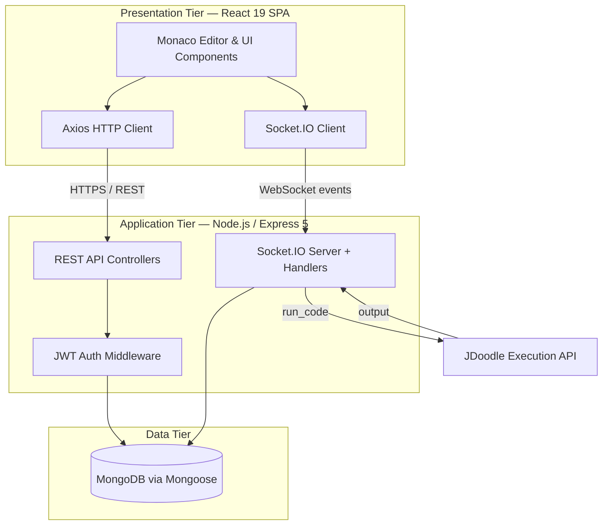

## 6.3 System Workflow

A representative end-to-end workflow:

1. A user authenticates (local, Google, or GitHub). The server issues a JWT in an `httpOnly` cookie.
2. The user lands on the **Dashboard**, which fetches their joined rooms (`GET /api/room/my-rooms`) and lets them search public rooms (`GET /api/room/search`).
3. The user **creates** a room (`POST /api/room/create`) or **requests to join** an existing one. For private rooms, the request enters a pending-approval queue.
4. Upon entering a room, the client opens a **WebSocket connection** and emits `join_room`. The server validates membership, joins the Socket.IO room, and updates presence.
5. As the user types, the client emits `code_change` events; the server persists the change and broadcasts `code_updated` to all other members, whose editors update live.
6. **Cursor movements**, **typing indicators**, **file additions/deletions**, and **chat messages** flow through analogous socket events.
7. When a user clicks **Run**, the client emits `run_code`; the server calls JDoodle and broadcasts the result (`code_result`) to the entire room.

## 6.4 Major Features

- Multi-provider authentication with secure, cookie-based JWT sessions.
- Public/private rooms with a moderated join-request workflow.
- Real-time, multi-file collaborative editing with live remote cursors and typing indicators.
- Role-based permissions (owner/moderator/member) governing every administrative action.
- Integrated, persistent, room-scoped chat.
- Multi-language code execution with stdin support.
- Presence tracking, ZIP export, light/dark theming, and a responsive mobile layout.

## 6.5 Technology Choices and Justification

| Concern | Technology | Justification |
|---|---|---|
| Server runtime | Node.js | Event-driven, non-blocking I/O ideal for many concurrent real-time connections |
| Web framework | Express 5 | Minimal, flexible, mature routing and middleware ecosystem |
| Real-time transport | Socket.IO | Rooms, auto-reconnect, fallbacks, and a simple event API over WebSockets |
| Database | MongoDB + Mongoose | Document model fits nested room state; schema validation via Mongoose |
| Authentication | JWT + bcrypt + OAuth | Stateless sessions; secure hashing; federated login convenience |
| Frontend | React 19 + Vite | Declarative components; fast HMR dev experience |
| Editor | Monaco | Industry-grade editing (the VS Code engine) with rich language support |
| Styling | Tailwind CSS 4 | Rapid, consistent, responsive utility-first styling |
| Code execution | JDoodle API | Off-server, multi-language execution without managing sandboxes |

## 6.6 Improvements Over the Existing System

- **Sub-second synchronization** replaces the commit/push/pull cycle.
- **Zero installation**—collaboration begins with a shared link in any modern browser.
- **Live cursors and presence** make collaboration spatially aware and natural.
- **Shared, one-click execution** removes the need for local runtimes.
- **Integrated chat** keeps discussion attached to the code.
- **Built-in access control** governs participation without relying on external repository hosts.

---

# 7. Software & Hardware Requirements

## 7.1 Software Requirements

| Category | Requirement / Technology | Version / Detail |
|---|---|---|
| Operating System | Windows / macOS / Linux | Any modern 64-bit OS (developed on macOS Darwin) |
| Runtime | Node.js | v18+ |
| Backend Language | JavaScript (ES Modules) | ECMAScript 2020+ |
| Backend Framework | Express | v5.x |
| Real-time Engine | Socket.IO | v4.x |
| Database | MongoDB | v6+ (local or Atlas) |
| ODM | Mongoose | v9.x |
| Frontend Library | React | v19.x |
| Build Tool | Vite | v8.x |
| Styling | Tailwind CSS | v4.x |
| Editor Component | @monaco-editor/react | v4.7 |
| Package Manager | npm | v9+ |
| IDE / Editor | Visual Studio Code | Latest |
| Version Control | Git + GitHub | Latest |
| Browser | Chrome / Firefox / Edge / Safari | Latest evergreen |
| Code Execution API | JDoodle Compiler API | v1 |

### Key Third-Party Libraries

**Backend:** `express`, `mongoose`, `socket.io`, `jsonwebtoken`, `bcrypt`, `cookie-parser`, `cors`, `dotenv`, `google-auth-library`, `uuid`, `nodemon`.

**Frontend:** `react`, `react-dom`, `react-router-dom` (v7), `@monaco-editor/react`, `@react-oauth/google`, `axios`, `socket.io-client`, `jszip`, `tailwindcss`, `@tailwindcss/vite`.

## 7.2 Hardware Requirements

| Component | Minimum | Recommended |
|---|---|---|
| Processor | Dual-core 2.0 GHz | Quad-core 2.5 GHz or higher |
| RAM | 4 GB | 8 GB or higher |
| Storage | 2 GB free | 5 GB+ (for Node modules, DB, build artifacts) |
| Internet | Stable broadband (required for real-time sync, OAuth, and JDoodle) | High-speed broadband |
| Development Machine | Any 64-bit laptop/desktop capable of running Node.js and a browser | SSD-equipped development workstation |

> Because the application is browser-based, **end users** require only a modern web browser and an internet connection; no special hardware is needed on the client side.

---

# 8. System Design

## 8.1 Overall Architecture

The system is organized into clearly delineated layers. The backend separates **routing**, **controllers** (business logic), **models** (data schemas), **middleware** (cross-cutting concerns such as authentication), and **socket handlers** (real-time logic). The frontend separates **pages**, **layouts**, **components**, **services** (API and socket clients), **hooks**, **context providers**, and **utilities**. This modular organization promotes maintainability and a clean separation of concerns.

## 8.2 Component Diagram

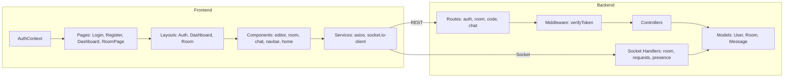

## 8.3 Database Design

KodaX uses three primary MongoDB collections, modelled with Mongoose. The document model allows a room to embed its files, members, and pending requests directly, minimizing the need for joins for the most common read patterns.

### 8.3.1 User Collection

| Field | Type | Description |
|---|---|---|
| `username` | String | Unique, required, trimmed |
| `email` | String | Unique, required, lowercase, trimmed |
| `password` | String | bcrypt hash; required only for local provider |
| `profilePic` | String | Avatar URL (default `null`) |
| `providers` | Array | `{ name: 'local'│'google'│'github', providerId }` — supports multiple linked identities |
| `socketId` | String | Current active WebSocket connection ID (presence) |
| `currentRoom` | String | The room the user is currently in |
| `createdAt`/`updatedAt` | Date | Mongoose timestamps |

### 8.3.2 Room Collection

| Field | Type | Description |
|---|---|---|
| `roomId` | String | Unique, indexed UUID identifying the room |
| `title` | String | Required, max 100 chars |
| `description` | String | Optional, max 300 chars |
| `code` | String | Legacy single-buffer code (fallback) |
| `files` | Array | `{ id, name, language, code }` — multi-file support |
| `language` | String | Enum of 8 languages; default `javascript` |
| `members` | Array | `{ user: ref User, role: owner│moderator│member, joinedAt }` |
| `pendingRequests` | Array | References to Users awaiting approval |
| `visibility` | String | `public` or `private` (indexed); default `private` |
| `settings` | Object | `{ allowGuests: Boolean, maxUsers: Number (default 10) }` |
| `createdAt`/`updatedAt` | Date | Mongoose timestamps |

A **text index** on `title`, `description`, and `language` powers room search.

### 8.3.3 Message Collection

| Field | Type | Description |
|---|---|---|
| `roomId` | ObjectId (ref Room) | The room the message belongs to |
| `sender` | ObjectId (ref User) | The author |
| `message` | String | Required, max 1000 chars |
| `createdAt`/`updatedAt` | Date | Mongoose timestamps |

### 8.3.4 Entity-Relationship Diagram

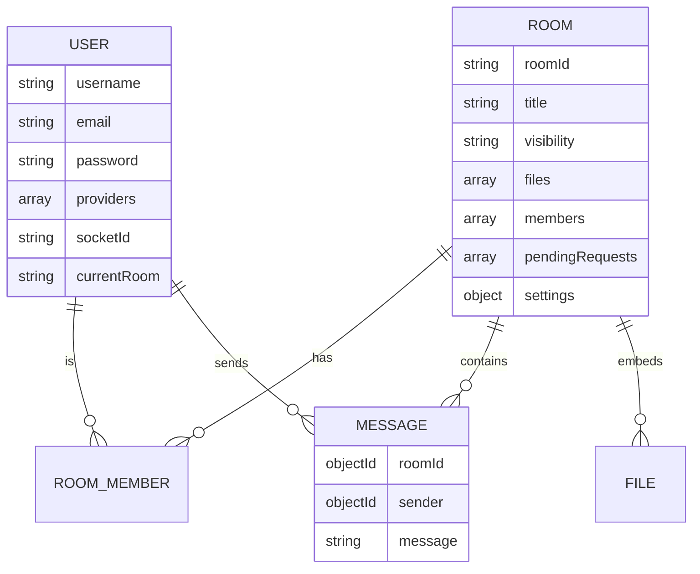

## 8.4 API Flow

All REST endpoints (except registration, login, and the OAuth handshakes) are protected by the `verifyToken` middleware, which extracts and validates the JWT from the cookie or `Authorization` header.

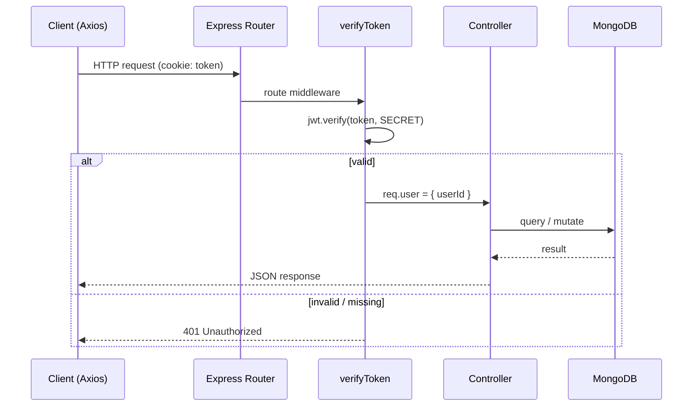

## 8.5 User Flow

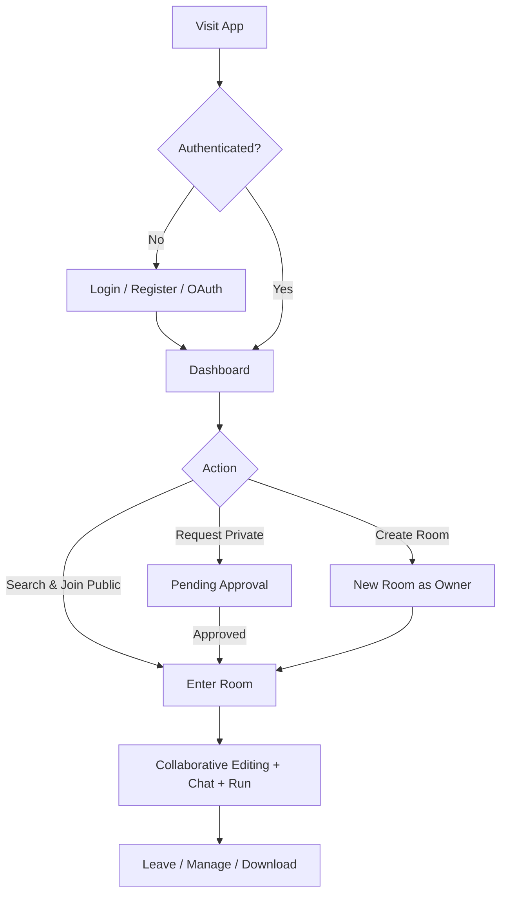

## 8.6 Sequence Diagram — Real-Time Code Editing

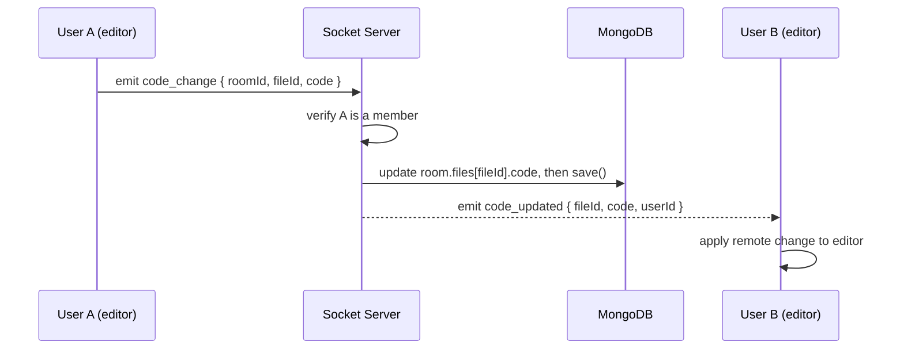

## 8.7 Sequence Diagram — Join Request Approval

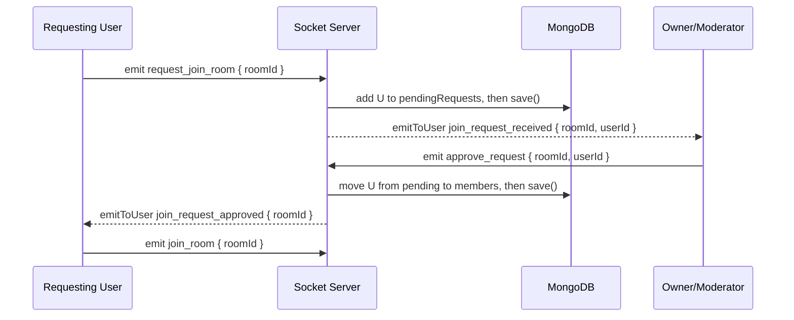

## 8.8 Class / Module Diagram (Conceptual)

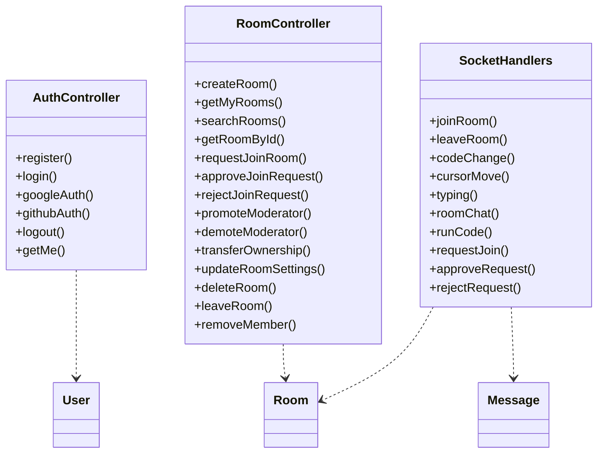

---

# 9. Flowchart & Algorithm

## 9.1 Application Flowchart

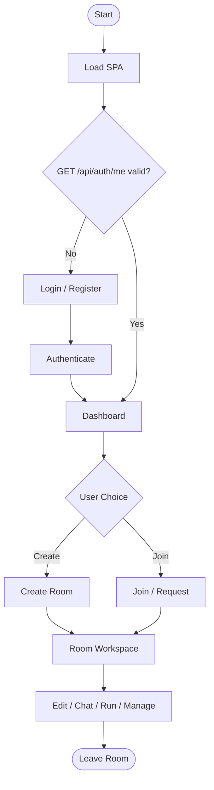

## 9.2 Login Flowchart

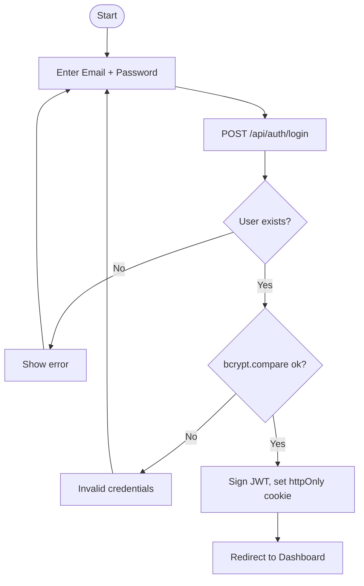

## 9.3 Main Process Flow — Real-Time Collaboration

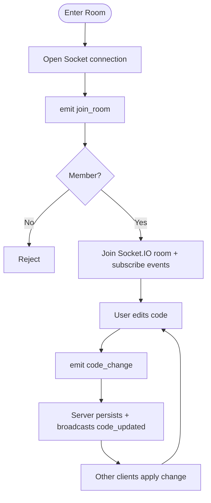

## 9.4 Algorithms for Major Workflows

### Algorithm 1 — User Registration

```
INPUT: username, email, password
1. Validate all fields are present.
2. Check whether a user with the same email or username exists.
   2.1 If yes → return 409 Conflict.
3. Hash the password using bcrypt with salt rounds = 10.
4. Create a User document with providers = [{ name: "local" }].
5. Sign a JWT: jwt.sign({ userId }, JWT_SECRET, { expiresIn: "7d" }).
6. Set the JWT as an httpOnly cookie named "token".
7. Return the user payload { id, username, email }.
OUTPUT: Authenticated session (cookie) + user payload.
```

### Algorithm 2 — Real-Time Code Change Propagation

```
INPUT: socket event code_change { roomId, fileId, code }
1. Authenticate the socket (JWT from handshake) → socket.userId.
2. Load the room by roomId.
3. Verify socket.userId is a member of room.members.
   3.1 If not → ignore / emit error.
4. If fileId is provided:
       Find the file in room.files with matching id and set file.code = code.
   Else:
       Set room.code = code (legacy single buffer).
5. Persist with room.save().
6. Broadcast to all OTHER sockets in roomId:
       socket.to(roomId).emit("code_updated", { fileId, code, userId }).
OUTPUT: Synchronized code across all room members.
```

### Algorithm 3 — Join Request Approval

```
INPUT: socket event approve_request { roomId, userId }
1. Load the room by roomId.
2. Verify the approver (socket.userId) is an owner or moderator.
3. Verify userId is present in room.pendingRequests.
4. Verify the room is below settings.maxUsers capacity.
5. Remove userId from room.pendingRequests.
6. Push { user: userId, role: "member" } into room.members.
7. Persist with room.save().
8. Notify the requester: emitToUser(io, userId, "join_request_approved", { roomId }).
OUTPUT: Requester becomes a member and can join the room.
```

### Algorithm 4 — Code Execution

```
INPUT: socket event run_code { roomId, code, language, stdin }
1. Verify the sender is a member of the room.
2. Broadcast io.to(roomId).emit("code_running", { userId, language }).
3. Map the editor language to a JDoodle language + version.
4. POST to JDoodle /v1/execute with { clientId, clientSecret, script, stdin, language, versionIndex }.
5. Receive { output } (or an error).
6. Broadcast io.to(roomId).emit("code_result", { output, error }).
OUTPUT: Execution output displayed to all room members.
```

---

# 10. Modules Description

KodaX is decomposed into well-defined functional modules. Each is described below in terms of its purpose, responsibilities, inputs, outputs, internal workflow, the files involved, and the technologies used.

## 10.1 Authentication Module

- **Purpose:** Manage user identity, registration, login, federated OAuth, and session lifecycle.
- **Responsibilities:** Validate credentials, hash and verify passwords, verify Google/GitHub identities, issue and clear JWT cookies, and expose the current user.
- **Inputs:** Registration/login form data; Google ID token or access token; GitHub authorization code.
- **Outputs:** A signed JWT in an `httpOnly` cookie and a sanitized user payload.
- **Internal Workflow:** Credentials or OAuth tokens are validated; a `User` document is created or located (linking providers when appropriate); a JWT encoding `userId` is signed and set as a cookie.
- **Files Involved:** `backend/controllers/authController.js`, `backend/routes/authRoutes.js`, `backend/middleware/authMiddleware.js`, `backend/models/User.js`; on the frontend `pages/auth/Login.jsx`, `Register.jsx`, `GithubCallback.jsx`, and `context/AuthContext.jsx`.
- **Technologies:** `jsonwebtoken`, `bcrypt`, `google-auth-library`, `cookie-parser`, `@react-oauth/google`.

## 10.2 Room Management Module

- **Purpose:** Create, discover, configure, and administer collaborative rooms.
- **Responsibilities:** Room creation with a unique UUID and default file; listing the user's rooms; searching public rooms; fetching room details; updating settings; and deleting rooms.
- **Inputs:** Room metadata (title, description, language, visibility, settings) and the authenticated user.
- **Outputs:** Room documents and confirmation responses.
- **Internal Workflow:** On creation, a `Room` is initialized with the creator as `owner`, a default file, and chosen visibility. Search uses a regex/text query against public rooms.
- **Files Involved:** `backend/controllers/roomController.js`, `backend/routes/roomRoutes.js`, `backend/models/Room.js`; frontend `pages/dashboard/Dashboard.jsx`, `CreateRoom.jsx`, and `components/create-room/*`, `components/home/*`.
- **Technologies:** Express, Mongoose, `uuid`.

## 10.3 Membership & Access Control Module

- **Purpose:** Govern who may join a room and what each member may do.
- **Responsibilities:** Manage the join-request workflow (request, approve, reject); enforce the owner/moderator/member hierarchy; promote/demote; transfer ownership; remove members; and handle the leaving of members (including owner succession).
- **Inputs:** Room ID, target user ID, and the acting user's role.
- **Outputs:** Updated `members` and `pendingRequests` arrays and targeted notifications.
- **Internal Workflow:** Every administrative action verifies the actor's role before mutating room state. When the owner leaves, ownership is automatically transferred to the next moderator or member.
- **Files Involved:** `backend/controllers/roomController.js`, `backend/sockets/handlers/requests/*`; frontend `components/room/MembersPanel.jsx`, `PendingRequests.jsx`, `MembersList.jsx`, and `utils/roleHelpers.js`.
- **Technologies:** Express, Mongoose, Socket.IO.

## 10.4 Real-Time Collaboration Module

- **Purpose:** Synchronize code, cursors, typing, and file structure across all members in real time.
- **Responsibilities:** Receive and broadcast `code_change`, `language_change`, `cursor_move`, `typing`, `add_file`, and `delete_file` events; persist code state to the database.
- **Inputs:** Socket events carrying room ID, file ID, code, cursor position, or file payloads.
- **Outputs:** Broadcast events (`code_updated`, `language_updated`, `cursor_updated`, `user_typing`, `file_added`, `file_deleted`) to all other room members.
- **Internal Workflow:** Each handler authenticates the socket, validates membership, mutates and persists room state where applicable, and broadcasts to the Socket.IO room excluding the sender.
- **Files Involved:** `backend/sockets/handlers/room/codeChange.js`, `cursorMove.js`, `typing.js`, `joinRoom.js`, `leaveRoom.js`, `backend/sockets/index.js`, `sockets/utils/emitToRoom.js`; frontend `pages/room/RoomPage.jsx` and `components/editor/*`.
- **Technologies:** Socket.IO, Monaco Editor.

## 10.5 Chat Module

- **Purpose:** Provide real-time, persistent, room-scoped text messaging.
- **Responsibilities:** Persist messages, broadcast them live, and serve message history on room entry.
- **Inputs:** `send_message { roomId, message }` socket events; `GET /api/chat/:roomId` for history.
- **Outputs:** A persisted `Message` document and a `receive_message` broadcast with populated sender details.
- **Internal Workflow:** On `send_message`, the server validates membership, creates a `Message`, populates the sender, and broadcasts to the room. History is loaded via REST when the room opens.
- **Files Involved:** `backend/sockets/handlers/room/roomChat.js`, `backend/controllers/chatController.js`, `backend/routes/chatRoutes.js`, `backend/models/Message.js`; frontend `components/room/ChatPanel.jsx` and `components/chat/*`.
- **Technologies:** Socket.IO, Mongoose.

## 10.6 Code Execution Module

- **Purpose:** Compile and run shared code in eight languages and display the output to all members.
- **Responsibilities:** Map editor languages to JDoodle runtimes, call the JDoodle API with optional stdin, and broadcast running status and results.
- **Inputs:** `run_code { roomId, code, language, stdin }`.
- **Outputs:** `code_running` and `code_result { output, error }` broadcasts.
- **Internal Workflow:** Upon receiving `run_code`, the server signals execution start, POSTs to JDoodle, and broadcasts the returned output (or error) to the entire room.
- **Files Involved:** `backend/sockets/handlers/room/runCode.js`, `backend/controllers/codeController.js`, `backend/routes/codeRoutes.js`; frontend `components/editor/RunCodeButton.jsx`, `CodeOutputPanel.jsx`, and `components/room/ConsolePanel.jsx`.
- **Technologies:** JDoodle Compiler API, Socket.IO.

## 10.7 Presence Module

- **Purpose:** Track which users are online and which room each is in.
- **Responsibilities:** Record a user's `socketId` on connect, clear it on disconnect, and broadcast online/offline status.
- **Inputs:** Socket connection and disconnection events.
- **Outputs:** `user_online` / `user_offline` broadcasts and updated `User.socketId` / `currentRoom`.
- **Files Involved:** `backend/sockets/handlers/presence/UserOnline.js`, `disconnect.js`, `sockets/utils/emitToUser.js`; frontend `components/room/OnlineUsers.jsx` and `components/navbar/NotificationBell.jsx`.
- **Technologies:** Socket.IO, Mongoose.

## 10.8 Frontend UI & Editor Module

- **Purpose:** Render the entire user experience—authentication pages, dashboard, and the collaborative room workspace.
- **Responsibilities:** Provide the Monaco-based editor, file explorer, tabs, console, chat panel, members panel, navigation, and responsive layouts; integrate live remote cursors.
- **Inputs:** Application state, socket events, and user interactions.
- **Outputs:** A rendered, interactive single-page application.
- **Files Involved:** `frontend/src/pages/*`, `layouts/*`, `components/*`, `app/routes.jsx`.
- **Technologies:** React 19, React Router 7, Tailwind CSS 4, Monaco Editor, `jszip`.

---

# 11. Implementation

This section describes how KodaX was implemented across the stack, referencing the actual files and components in the workspace.

## 11.1 Project Folder Structure

```
Real_time_collaborative_code-editor/
├── backend/
│   ├── server.js                # HTTP + Socket.IO bootstrap
│   ├── app.js                   # Express app, CORS, parsers, routes, error handling
│   ├── config/db.js             # MongoDB connection
│   ├── models/                  # User.js, Room.js, Message.js
│   ├── controllers/             # authController, roomController, chatController, codeController
│   ├── routes/                  # authRoutes, roomRoutes, chatRoutes, codeRoutes
│   ├── middleware/              # authMiddleware (verifyToken)
│   └── sockets/
│       ├── index.js             # Socket registration & auth wiring
│       ├── middlewares/         # socketAuth.js
│       ├── utils/               # emitToRoom.js, emitToUser.js
│       └── handlers/
│           ├── room/            # joinRoom, leaveRoom, codeChange, cursorMove, typing, roomChat, runCode
│           ├── requests/        # requestJoin, approveRequest, rejectRequest
│           └── presence/        # UserOnline, disconnect
└── frontend/
    └── src/
        ├── app/                 # main.jsx, App.jsx, routes.jsx
        ├── context/             # AuthContext, SocketProvider
        ├── layouts/             # AuthLayout, DashboardLayout, RoomLayout
        ├── pages/               # auth/, dashboard/, room/, legal/
        ├── components/          # editor/, room/, chat/, navbar/, home/, footer/, common/, create-room/, dashboard/
        ├── services/            # api/ (axios, authApi, roomApi, messageApi), socket/
        ├── hooks/               # useAuth, useSocket, useRoom, useDebounce, useTypingIndicator
        └── utils/               # constants, roleHelpers, copyToClipboard, formatDate, generateAvatar
```

This structure cleanly separates backend concerns (routing → controllers → models, with sockets isolated by domain) and frontend concerns (pages → layouts → components, with services, hooks, and utilities supporting them).

## 11.2 Backend Implementation

### 11.2.1 Server Bootstrap

The entry point `server.js` loads environment variables with `dotenv`, connects to MongoDB, creates an HTTP server wrapping the Express app, attaches a Socket.IO server with CORS configured for the frontend origin, and initializes the socket layer:

```javascript
const server = http.createServer(app);
const io = new Server(server, {
  cors: { origin: "http://localhost:5173", credentials: true }
});
initSocket(io);
const port = process.env.PORT || 4000;
server.listen(port, () => console.log(`Server running on port ${port}`));
```

### 11.2.2 Express Application

`app.js` configures the middleware stack: CORS (allowing the Vite dev origins with credentials), `express.json()` for body parsing, and `cookie-parser` for reading the `httpOnly` JWT cookie. Routes are mounted under `/api/auth`, `/api/room`, `/api/code`, and `/api/chat`. A 404 handler and a centralized error-handling middleware translate Mongoose `ValidationError`, `CastError`, and duplicate-key (`11000`) errors into appropriate HTTP status codes (400, 409), defaulting to 500 for unexpected failures.

### 11.2.3 Database Integration

`config/db.js` establishes the Mongoose connection using the `DB_URL` environment variable. A failed connection logs the error and terminates the process (`process.exit(1)`), ensuring the server never runs in a half-initialized state.

## 11.3 API Development

The REST API is organized by resource:

- **Auth (`/api/auth`):** `POST /register`, `POST /login`, `POST /google`, `POST /github`, `POST /logout`, and `GET /me` (protected).
- **Room (`/api/room`):** `POST /create`, `GET /my-rooms`, `GET /search`, `GET /:roomId`, `POST /:roomId/request-join`, `GET /:roomId/pending`, `POST /:roomId/approve/:userId`, `POST /:roomId/reject/:userId`, `PATCH /:roomId/promote/:userId`, `PATCH /:roomId/demote/:userId`, `PATCH /:roomId/transfer-ownership/:userId`, `PATCH /:roomId/settings`, `POST /:roomId/leave`, `POST /:roomId/remove/:userId`, and `DELETE /:roomId`.
- **Code (`/api/code`):** `GET /:roomId` and `PUT /:roomId` for retrieving and persisting code.
- **Chat (`/api/chat`):** `GET /:roomId` for paginated message history.

Every route other than the public auth endpoints is guarded by `verifyToken`, and controllers perform additional role-based authorization where required.

## 11.4 Authentication

Authentication is multi-provider. For **local** auth, passwords are hashed with bcrypt (salt rounds = 10) on registration and compared with `bcrypt.compare` on login. For **Google**, the `google-auth-library` verifies the ID token (or the access token is used to fetch user info) and the profile is mapped to a local user, linking a `google` provider. For **GitHub**, the authorization `code` is exchanged for an access token, the user's profile and primary email are fetched from the GitHub API, and a local user is created or linked. In all cases, a JWT encoding `userId` is signed with a 7-day expiry and set as a secure `httpOnly` cookie:

```javascript
const token = jwt.sign({ userId: user._id }, process.env.JWT_SECRET, { expiresIn: '7d' });
res.cookie('token', token, {
  httpOnly: true,
  secure: process.env.NODE_ENV === 'production',
  sameSite: 'lax'
});
```

The same cookie is reused to authenticate the WebSocket handshake, unifying the security model across both channels.

## 11.5 Real-Time Implementation (Socket Layer)

The socket layer is initialized in `sockets/index.js`, which applies the `socketAuth` middleware to every connection. `socketAuth` extracts the JWT from either `socket.handshake.auth.token` or the handshake cookie, verifies it, and attaches `socket.userId`. Handlers are then registered by domain—room operations, join requests, and presence.

Two utility helpers underpin targeted messaging: `emitToRoom` broadcasts an event to every socket in a room (optionally excluding the sender), while `emitToUser` looks up a user's current `socketId` from the database and emits an event to that specific connection—used, for example, to notify a moderator of a new join request.

The collaborative editing core lives in `codeChange.js`, which, after validating membership, updates the targeted file's code (or the legacy single buffer), persists it, and broadcasts `code_updated` to the rest of the room. Cursor positions (`cursor_move` → `cursor_updated`) and typing activity (`typing` → `user_typing`) are broadcast without persistence, as they are ephemeral.

## 11.6 Routing (Frontend)

The frontend uses **React Router 7**. Routes are defined in `app/routes.jsx`: public routes (`/login`, `/register`, `/auth/github/callback`, `/privacy-policy`, `/terms-conditions`) and protected routes (`/` dashboard, `/room/:roomId`). Two guard components enforce access: `ProtectedRoute` redirects unauthenticated users to `/login` (preserving the intended destination), while `PublicRoute` redirects already-authenticated users away from auth pages to the dashboard. While the authentication status is being resolved, a loader is shown to prevent flicker.

## 11.7 State Management

Application-wide authentication state is provided through React's **Context API** via `AuthContext`, which exposes `{ user, loading, login, logout }` and, on mount, calls `GET /api/auth/me` to restore the session from the cookie. The complex, high-frequency state of the room workspace—open files, the active file, remote cursors, console output, and chat messages—is managed within the `RoomPage` component using React hooks (`useState`, `useRef`, `useEffect`), keeping the real-time editing logic colocated with the component that renders it.

## 11.8 Frontend Editor Integration

The editing experience is built on `@monaco-editor/react`. The `RoomPage` registers editor lifecycle callbacks: `beforeMount` defines a custom light theme (`kodax-light`), and `onMount` captures editor and monaco references and subscribes to cursor-position changes to emit `cursor_move`. The `onChange` handler updates local file state, emits `code_change`, and uses guard flags (`isTypingLocally`, `isRemoteUpdate`) to prevent feedback loops between local typing and remote updates. Remote collaborators' cursors are rendered as Monaco **content widgets**, each labelled with the collaborator's username and assigned a deterministic color from a fixed palette. Eight languages are supported—JavaScript, Python, Java, C++, C, Ruby, Go, and PHP—with file-extension-to-language mapping for new files.

## 11.9 Validation

Validation is layered. At the **data layer**, Mongoose schemas enforce required fields, uniqueness (username, email, roomId), enumerations (language, role, visibility), and length limits (title ≤ 100, description ≤ 300, message ≤ 1000). At the **controller layer**, inputs are checked for presence and for business rules (e.g., duplicate join requests, room capacity). On the **frontend**, forms validate required fields and require explicit agreement to the terms before registration.

## 11.10 Error Handling

The backend centralizes error handling in `app.js`, mapping Mongoose errors and MongoDB duplicate-key violations to meaningful HTTP responses and shielding internal details behind a generic 500 message. The database connection fails fast on startup. On the frontend, the Axios instance includes a response interceptor that detects `401 Unauthorized` responses (indicating an expired or missing session) and surfaces a re-authentication path, and individual pages handle and display API and socket errors to the user.

## 11.11 Security Practices

- **Password hashing** with bcrypt; plaintext passwords are never stored.
- **`httpOnly` cookies** for JWTs, mitigating XSS-based token theft; `secure` in production and `sameSite: lax` to limit CSRF exposure.
- **Authenticated WebSockets**—every socket connection is verified before any handler runs.
- **Authorization checks** on every administrative action (REST and socket), enforcing the role hierarchy.
- **CORS** restricted to known frontend origins with credentials enabled.
- **Server-side membership validation** on all real-time operations, so a client cannot manipulate a room it does not belong to.
- **Off-server code execution** via JDoodle, isolating untrusted code from the application server.

## 11.12 Performance Optimization

- **Event-driven, non-blocking** Node.js handles many concurrent socket connections efficiently.
- **Targeted broadcasting** via Socket.IO rooms ensures events reach only relevant clients.
- **Debounced search** (≈300 ms) on the dashboard reduces redundant API calls.
- **Indexed queries**—`roomId`, `visibility`, and a text index on room fields accelerate lookups and search.
- **Sender exclusion** in broadcasts avoids echoing a user's own edits back to them.
- **Ephemeral events** (cursor, typing) are broadcast without database writes, minimizing I/O.
- **Vite** provides fast builds and optimized production bundles for the frontend.

## 11.13 Deployment Approach

The backend is a standard Node.js service started with `npm start` (or `npm run dev` with `nodemon` during development) and is additionally exported as an Express `app` for compatibility with serverless platforms such as Vercel. The frontend is built with `vite build` into static assets that can be served by any static host or CDN. MongoDB can be provisioned locally or via MongoDB Atlas. All secrets—database URL, JWT secret, OAuth client credentials, and JDoodle credentials—are supplied through environment variables (see `backend/.env.example`), keeping configuration out of source control.

---

# 12. Results / Output Screens

This section presents the key screens of the application. Replace each placeholder with an actual screenshot before submission; captions and explanations describe what each screen demonstrates.

### 12.1 Home / Landing & Authentication

**[Screenshot Placeholder — Login Screen]**
*Caption:* The KodaX login page.
This screen demonstrates the multi-provider authentication entry point: an email/password form alongside **Continue with Google** and **Continue with GitHub** buttons. It validates inputs client-side and, on success, establishes a session via an `httpOnly` cookie before redirecting to the dashboard.

**[Screenshot Placeholder — Registration Page]**
*Caption:* New user registration.
Demonstrates account creation with username, email, and password fields, a mandatory terms-of-service agreement checkbox, and the same federated login options. The password is hashed with bcrypt on the server.

### 12.2 Dashboard

**[Screenshot Placeholder — Dashboard]**
*Caption:* The user dashboard.
Demonstrates the two-panel layout: the user's **joined rooms** on one side and a **searchable list of public rooms** on the other, with debounced search, visibility and language badges, a room-details modal, and a **Create Room** action.

**[Screenshot Placeholder — Create Room Modal]**
*Caption:* Creating a new room.
Demonstrates configuring a room's title, description, language, and visibility (public/private). On submission, the creator becomes the room owner and a default file is created.

### 12.3 Main Feature Screen — Collaborative Room

**[Screenshot Placeholder — Room Workspace]**
*Caption:* The collaborative editing workspace.
This is the core feature screen. It demonstrates the **file explorer**, **editor tabs**, the **Monaco editor** with syntax highlighting, the **console panel** (output/stdin), the **chat panel**, and the **members panel**. Live remote cursors labelled with collaborators' usernames illustrate real-time presence.

**[Screenshot Placeholder — Live Collaboration (Two Users)]**
*Caption:* Two users editing simultaneously.
Demonstrates real-time code synchronization: an edit by one user appears near-instantly in the other's editor, with the remote user's cursor rendered as a labelled content widget.

### 12.4 Code Execution

**[Screenshot Placeholder — Code Execution Output]**
*Caption:* Running shared code.
Demonstrates clicking **Run**, providing standard input in the STDIN tab, and viewing the execution output—broadcast to every member of the room—in the OUTPUT tab.

### 12.5 Membership & Requests

**[Screenshot Placeholder — Pending Requests / Members Panel]**
*Caption:* Managing membership.
Demonstrates the members list with role badges (owner/moderator/member), the pending-join-requests queue with approve/reject actions, and role-management controls (promote, demote, remove, transfer ownership).

### 12.6 Chat

**[Screenshot Placeholder — Room Chat]**
*Caption:* Integrated real-time chat.
Demonstrates the room-scoped chat panel with sender avatars, timestamps, and live message delivery, alongside persistent history loaded on room entry.

### 12.7 Settings & Final Output

**[Screenshot Placeholder — Room Settings Modal]**
*Caption:* Room settings.
Demonstrates editing room title, description, visibility, and capacity, plus owner-only actions such as deleting the room.

**[Screenshot Placeholder — ZIP Download / Final Output]**
*Caption:* Exporting the project.
Demonstrates downloading all room files as a single ZIP archive, representing the final tangible output of a collaborative session.

---

# 13. Advantages & Limitations

## 13.1 Advantages

- **Zero-install collaboration** — works entirely in a browser; collaboration starts with a shared link.
- **True real-time editing** — sub-second propagation of code, cursors, and typing across all members.
- **Multi-provider authentication** — local, Google, and GitHub login with secure, cookie-based sessions.
- **Granular access control** — owner/moderator/member roles with a moderated join workflow.
- **Integrated execution** — run code in eight languages with stdin, without local runtimes.
- **Unified communication** — chat lives alongside the code being discussed.
- **Multi-file support** — structured projects with per-file languages.
- **Responsive and themeable** — adapts to desktop and mobile with light/dark modes.
- **Clean, modular architecture** — clear separation between REST and WebSocket concerns aids maintainability.

## 13.2 Limitations

- **Last-write-wins synchronization** — without OT/CRDT, truly simultaneous edits to the *same* region can overwrite one another.
- **Dependency on a third-party executor** — code execution relies on the JDoodle API's availability and quotas.
- **No persistent version history** — the platform is for live collaboration, not long-term version control.
- **Text-only communication** — no built-in voice/video.
- **Single-buffer persistence nuance** — a legacy `code` field coexists with the multi-file model for backward compatibility.
- **Internet-dependent** — all real-time features require connectivity.

## 13.3 Comparative Summary

| Aspect | Strength | Trade-off |
|---|---|---|
| Synchronization | Fast, simple, low-latency | Not conflict-free at character level |
| Execution | Multi-language, no local setup | External API dependency |
| Security | JWT + bcrypt + OAuth + role checks | Cookie-based sessions require careful CORS/SameSite config |
| Architecture | Modular, dual-channel | Two channels increase integration complexity |
| Persistence | Durable rooms, messages, code | No commit-level history |

---

# 14. Future Enhancements

The following enhancements would extend KodaX toward a production-grade commercial product:

1. **Conflict-free editing (CRDT/OT).** Integrate a library such as Yjs to enable true character-level concurrent editing without overwrites.
2. **AI integration.** Add AI-assisted code completion, explanation, and review (for example, using the latest Claude models) directly within the editor.
3. **Self-hosted sandboxed execution.** Replace the third-party executor with containerized (e.g., Docker/Firecracker) sandboxes for greater control, security, and language coverage.
4. **Voice and video calling.** Add WebRTC-based audio/video to complement text chat for richer collaboration.
5. **Enhanced security.** Introduce refresh tokens with rotation, rate limiting, two-factor authentication, and audit logging.
6. **Cloud-native deployment & scalability.** Deploy behind a load balancer with a Redis adapter for Socket.IO to scale horizontally across multiple server instances.
7. **Analytics dashboard.** Provide owners with insights into room activity, participation, and execution history.
8. **Persistent version history.** Snapshot room state over time to allow reverting and reviewing changes.
9. **Mobile application.** Build a native companion app for on-the-go participation.
10. **Automation & CI.** Add automated testing, linting gates, and CI/CD pipelines for reliable continuous delivery.

---

# 15. Conclusion

This internship centred on the design and end-to-end implementation of **KodaX**, a real-time collaborative code editor, and proved to be a comprehensive and transformative learning experience. The project demanded engagement with nearly every layer of modern full-stack web development—from NoSQL data modelling and secure authentication to RESTful API design, real-time WebSocket engineering, third-party API integration, and sophisticated frontend development with the Monaco editor.

**Project outcomes.** A fully functional application was delivered that supports multi-provider authentication, public/private rooms with a role-based join-approval workflow, real-time multi-file collaborative editing with live remote cursors and typing indicators, integrated persistent chat, multi-language code execution with standard input, presence tracking, and project export. The architecture's deliberate separation of a REST channel for durable state and a WebSocket channel for ephemeral real-time interaction proved both effective and instructive.

**Skills gained.** The internship developed practical competence in building **real-time, event-driven systems**, designing and securing **authentication and authorization** (JWT, bcrypt, OAuth, role hierarchies), modelling data in **MongoDB/Mongoose**, designing **REST and socket APIs**, and constructing a polished, responsive **React 19** frontend. Equally valuable were the softer engineering skills: reasoning about concurrency and shared state, debugging across the client–server boundary, integrating disparate third-party services into a coherent whole, and structuring a large codebase for maintainability.

**Technical learning.** Beyond individual technologies, the project cultivated an architectural mindset—understanding *why* certain concerns belong on the REST channel and others on the WebSocket channel, how to keep two communication channels secured by a single source of truth, and how small design decisions (such as excluding the sender from broadcasts or avoiding database writes for ephemeral events) compound into a responsive user experience.

**Overall conclusion.** KodaX successfully demonstrates that a frictionless, browser-based, real-time collaborative coding environment can be built from first principles using open technologies. While there remain clear avenues for enhancement—most notably conflict-free editing and self-hosted execution—the delivered system meets all of its primary and functional objectives. The internship achieved its central goal of providing deep, hands-on, industry-relevant experience in building complex, real-world full-stack software, and the knowledge and confidence gained form a strong foundation for a career in software engineering.

---

# 16. References

[1] OpenJS Foundation, *Node.js Documentation*. [Online]. Available: https://nodejs.org/en/docs/

[2] OpenJS Foundation, *Express 5.x API Reference*. [Online]. Available: https://expressjs.com/

[3] Socket.IO, *Socket.IO Documentation*. [Online]. Available: https://socket.io/docs/v4/

[4] MongoDB Inc., *MongoDB Manual*. [Online]. Available: https://www.mongodb.com/docs/

[5] Automattic, *Mongoose ODM Documentation*. [Online]. Available: https://mongoosejs.com/docs/

[6] Meta Open Source, *React Documentation*. [Online]. Available: https://react.dev/

[7] Vite, *Vite Guide*. [Online]. Available: https://vitejs.dev/guide/

[8] Tailwind Labs, *Tailwind CSS Documentation*. [Online]. Available: https://tailwindcss.com/docs

[9] Microsoft, *Monaco Editor API Documentation*. [Online]. Available: https://microsoft.github.io/monaco-editor/

[10] Remix / React Router, *React Router Documentation*. [Online]. Available: https://reactrouter.com/

[11] Auth0, *JSON Web Tokens — Introduction*. [Online]. Available: https://jwt.io/introduction

[12] M. F. Provos and N. Provos, *bcrypt Password Hashing*. [Online]. Available: https://www.npmjs.com/package/bcrypt

[13] Google, *Google Identity — OAuth 2.0 and google-auth-library*. [Online]. Available: https://developers.google.com/identity

[14] GitHub, *Authorizing OAuth Apps*. [Online]. Available: https://docs.github.com/en/apps/oauth-apps

[15] JDoodle, *JDoodle Compiler API Documentation*. [Online]. Available: https://docs.jdoodle.com/compiler-api/compiler-api

[16] Axios, *Axios HTTP Client Documentation*. [Online]. Available: https://axios-http.com/docs/intro

[17] Stuk, *JSZip Documentation*. [Online]. Available: https://stuk.github.io/jszip/

[18] Mozilla Developer Network, *Web Technologies for Developers (MDN)*. [Online]. Available: https://developer.mozilla.org/

[19] M. Kleppmann, *Designing Data-Intensive Applications*. Sebastopol, CA, USA: O'Reilly Media, 2017.

[20] Project Repository — *Real-Time Collaborative Code Editor (KodaX)*, GitHub. [Online]. Available: https://github.com/Varun2526/Real_time_collaborative_code-editor

---

# 17. Source Code

This section presents a curated selection of important code excerpts that illustrate the core of the implementation. Only representative snippets are shown; the full source resides in the project workspace.

## 17.1 Application Entry Point (Server Bootstrap)

`backend/server.js` wires together the HTTP server, Socket.IO, and the database connection:

```javascript
import { config } from "dotenv";
import connectDB from "./config/db.js";
import app from "./app.js";
import http from "http";
import { Server } from "socket.io";
import { initSocket } from "./sockets/index.js";

config();
connectDB();

const server = http.createServer(app);
const io = new Server(server, {
  cors: { origin: "http://localhost:5173", credentials: true }
});

initSocket(io);

const port = process.env.PORT || 4000;
server.listen(port, () => console.log(`Server running on port ${port}`));
```

*Explanation:* Environment variables are loaded, the database is connected, and the Express app is wrapped in a raw HTTP server so that Socket.IO can share the same port. `initSocket` registers all real-time handlers and the socket authentication middleware.

## 17.2 Express App, Routing & Error Handling

`backend/app.js` configures middleware and mounts the resource routers:

```javascript
const app = exp();
app.use(cors({ origin: ["http://localhost:5174", "http://localhost:5173"], credentials: true }));
app.use(exp.json());
app.use(cookieParser());

app.use("/api/auth", router);
app.use("/api/room", roomRouter);
app.use("/api/code", codeRouter);
app.use("/api/chat", chatRoutes);

// Centralized error handling
app.use((err, req, res, next) => {
  if (err.name === "ValidationError" || err.name === "CastError")
    return res.status(400).json({ message: "error occurred", error: err.message });
  const errCode = err.code ?? err.cause?.code ?? err.errorResponse?.code;
  if (errCode === 11000) {
    const field = Object.keys(err.keyValue)[0];
    return res.status(409).json({ message: "error occurred", error: `${field} already exists` });
  }
  res.status(500).json({ message: "error occurred", error: "Server side error" });
});
```

*Explanation:* CORS is restricted to the known frontend origins with credentials enabled so the JWT cookie is transmitted. The error middleware converts validation, cast, and duplicate-key errors into precise HTTP status codes.

## 17.3 Authentication — JWT Middleware

`backend/middleware/authMiddleware.js` protects REST routes:

```javascript
export const verifyToken = (req, res, next) => {
  const token = req.cookies?.token || req.headers.authorization?.split(" ")[1];
  if (!token) return res.status(401).json({ message: "Unauthorized: No token" });
  try {
    const decoded = jwt.verify(token, process.env.JWT_SECRET);
    req.user = { userId: decoded.userId };
    next();
  } catch (err) {
    return res.status(401).json({ message: "Invalid or expired token" });
  }
};
```

*Explanation:* The middleware accepts the token from either the `httpOnly` cookie or an `Authorization: Bearer` header, verifies it, and attaches `userId` to the request for downstream controllers.

## 17.4 Socket Authentication

`backend/sockets/middlewares/socketAuth.js` secures every WebSocket connection:

```javascript
export const socketAuth = (socket, next) => {
  const cookieString = socket.handshake.headers.cookie || "";
  let token = socket.handshake.auth.token;
  if (!token && cookieString) {
    const cookies = Object.fromEntries(cookieString.split('; ').map(c => c.split('=')));
    token = cookies.token;
  }
  if (!token) return next(new Error("Unauthorized: Token missing"));
  try {
    const decoded = jwt.verify(token, process.env.JWT_SECRET);
    socket.userId = decoded.userId;
    next();
  } catch (err) {
    next(new Error("Unauthorized: Invalid token"));
  }
};
```

*Explanation:* The same JWT used for REST is reused for the socket handshake—read from the auth payload or parsed from the cookie—unifying the security model across both channels.

## 17.5 Database Connection

`backend/config/db.js`:

```javascript
const connectDB = async () => {
  try {
    await connect(process.env.DB_URL);
    console.log("DB connected");
  } catch (err) {
    console.log("DB error:", err);
    process.exit(1);
  }
};
```

*Explanation:* The connection fails fast—if MongoDB is unreachable, the process exits rather than running in an inconsistent state.

## 17.6 Core Real-Time Logic — Code Synchronization

`backend/sockets/handlers/room/codeChange.js` (essential logic):

```javascript
// after validating the user is a member of the room
if (fileId) {
  const file = room.files.find(f => f.id === fileId);
  if (file) file.code = code;
} else {
  room.code = code; // legacy single-buffer fallback
}
await room.save();
socket.to(roomId).emit("code_updated", { fileId, code, userId: socket.userId });
```

*Explanation:* The change is persisted to the correct file and then broadcast to **all other** members of the room (the sender is excluded via `socket.to`), achieving live synchronization while avoiding echoing the edit back to its author.

## 17.7 Targeted Notification — Join Request Approval

`backend/sockets/handlers/requests/approveRequest.js` (essential logic):

```javascript
room.pendingRequests = room.pendingRequests.filter(id => id.toString() !== userId);
room.members.push({ user: userId, role: "member" });
await room.save();
await emitToUser(io, userId, "join_request_approved", { roomId });
```

*Explanation:* After authorization, the requester is moved from the pending queue into the members list and notified directly via `emitToUser`, which resolves the user's current `socketId` from the database and emits only to that connection.

## 17.8 Frontend — Application Bootstrap

`frontend/src/app/main.jsx`:

```javascript
const clientId = import.meta.env.VITE_GOOGLE_CLIENT_ID;
createRoot(document.getElementById('root')).render(
  <StrictMode>
    <AuthProvider>
      <GoogleOAuthProvider clientId={clientId}>
        <App />
      </GoogleOAuthProvider>
    </AuthProvider>
  </StrictMode>
);
```

*Explanation:* The app is wrapped in the `AuthProvider` (session state) and the `GoogleOAuthProvider` (federated login), establishing the global context before routing begins.

## 17.9 Frontend — Axios Instance with Interceptor

`frontend/src/services/api/axios.js`:

```javascript
const api = axios.create({
  baseURL: API_URL,
  withCredentials: true,
  headers: { 'Content-Type': 'application/json' }
});

api.interceptors.response.use(
  (response) => response,
  (error) => {
    if (error.response?.status === 401) {
      console.warn('Session expired. Redirecting to login...');
    }
    return Promise.reject(error);
  }
);
```

*Explanation:* `withCredentials: true` ensures the `httpOnly` JWT cookie accompanies every request, and the interceptor centralizes handling of expired sessions.

## 17.10 Frontend — Monaco Editor & Real-Time Wiring

`frontend/src/pages/room/RoomPage.jsx` (essential logic):

```javascript
const socket = io(SOCKET_URL, { withCredentials: true });
socket.on('connect', () => socket.emit('join_room', { roomId }));

const handleEditorChange = (value) => {
  isTypingLocally.current = true;
  setFiles(prev => prev.map(f => f.id === activeFileId ? { ...f, code: value } : f));
  socketRef.current?.emit('code_change', { roomId, fileId: activeFileId, code: value });
  setTimeout(() => { isTypingLocally.current = false; }, 500);
};

socket.on('code_updated', ({ fileId, code }) => {
  isRemoteUpdate.current = true;
  setFiles(prev => prev.map(f => f.id === fileId ? { ...f, code } : f));
});
```

*Explanation:* Local edits emit `code_change` and are reflected in component state; incoming `code_updated` events apply remote changes. The `isTypingLocally` and `isRemoteUpdate` flags guard against feedback loops between the two directions of synchronization.

---

*End of Report.*
